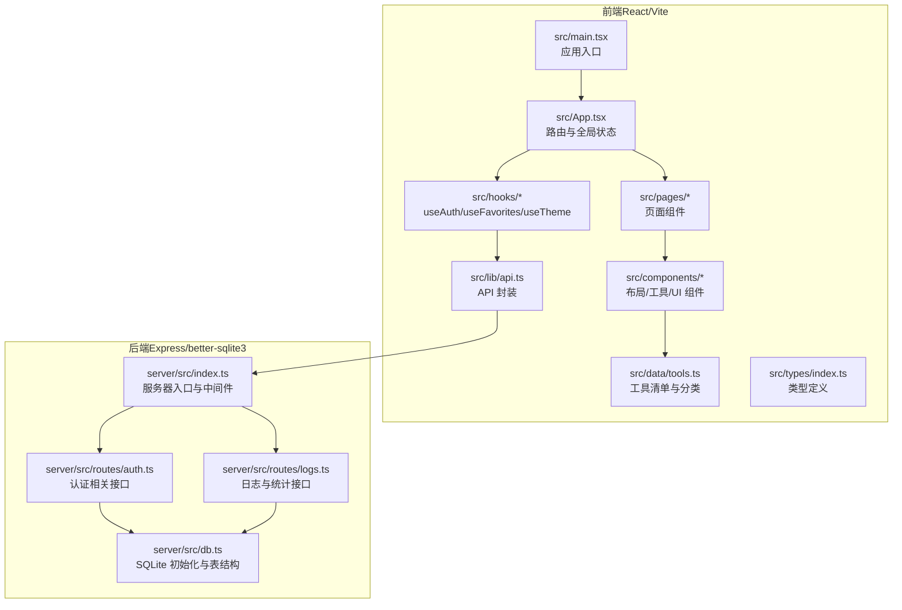
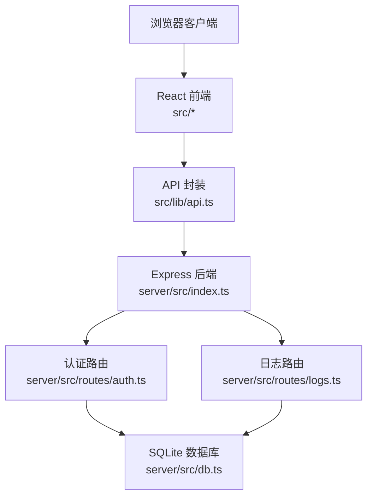
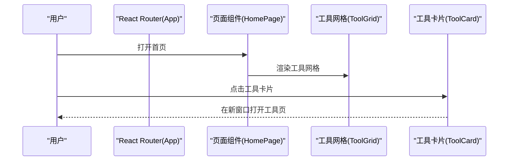
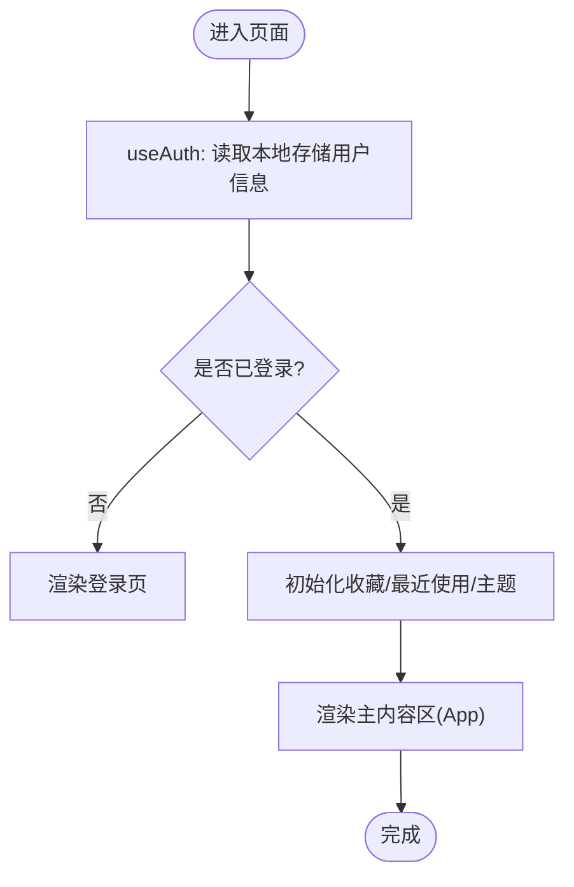
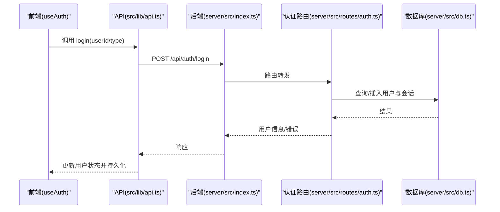
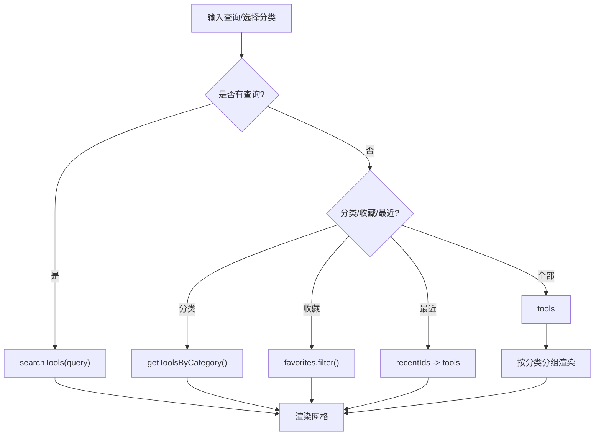
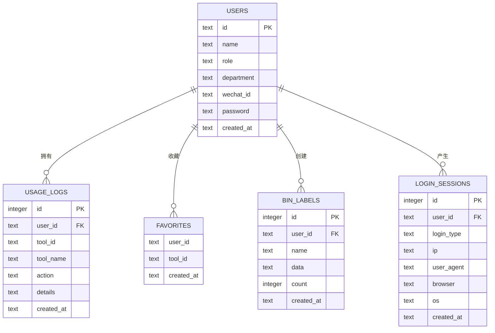
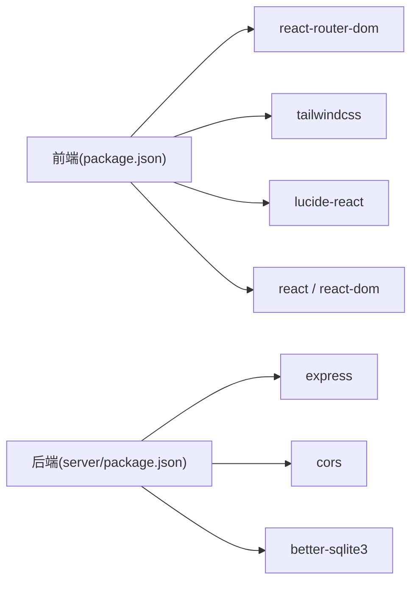

# 系统架构

<cite>
**本文引用的文件**
- [package.json](file://package.json)
- [server/package.json](file://server/package.json)
- [src/main.tsx](file://src/main.tsx)
- [src/App.tsx](file://src/App.tsx)
- [src/lib/api.ts](file://src/lib/api.ts)
- [src/hooks/useAuth.ts](file://src/hooks/useAuth.ts)
- [src/hooks/useFavorites.ts](file://src/hooks/useFavorites.ts)
- [src/hooks/useTheme.ts](file://src/hooks/useTheme.ts)
- [src/pages/HomePage.tsx](file://src/pages/HomePage.tsx)
- [src/components/tools/ToolGrid.tsx](file://src/components/tools/ToolGrid.tsx)
- [src/data/tools.ts](file://src/data/tools.ts)
- [src/types/index.ts](file://src/types/index.ts)
- [server/src/index.ts](file://server/src/index.ts)
- [server/src/db.ts](file://server/src/db.ts)
- [server/src/routes/auth.ts](file://server/src/routes/auth.ts)
- [server/src/routes/logs.ts](file://server/src/routes/logs.ts)
</cite>

## 目录
1. [引言](#引言)
2. [项目结构](#项目结构)
3. [核心组件](#核心组件)
4. [架构总览](#架构总览)
5. [详细组件分析](#详细组件分析)
6. [依赖分析](#依赖分析)
7. [性能考虑](#性能考虑)
8. [故障排查指南](#故障排查指南)
9. [结论](#结论)
10. [附录](#附录)

## 引言
本文件为 AnyTools 的系统架构文档，面向前端工程师与后端工程师，以及对系统设计感兴趣的读者。文档围绕前后端分离架构、React 前端应用与 Express 后端服务的交互机制展开，解释数据流从用户界面到 API 请求再到数据库操作的完整链路，并总结组件化架构设计（页面组件、工具组件、UI 组件）、路由系统、状态管理模式与全局状态管理的设计要点与权衡。

## 项目结构
AnyTools 采用典型的前后端分离结构：
- 前端：基于 Vite + React 18 + React Router DOM 构建，使用 TailwindCSS 进行样式组织，组件按功能域分层（layout、ui、tools、pages）。
- 后端：基于 Express + better-sqlite3，提供 RESTful 接口，路由按业务模块划分（auth、logs、network、favorites、binLabels、admin），内置 SQLite 数据库存储用户、日志、收藏、标签等数据。

图表来源
- [src/main.tsx:1-14](file://src/main.tsx#L1-L14)
- [src/App.tsx:1-63](file://src/App.tsx#L1-L63)
- [src/lib/api.ts:1-36](file://src/lib/api.ts#L1-L36)
- [src/hooks/useAuth.ts:1-89](file://src/hooks/useAuth.ts#L1-L89)
- [src/hooks/useFavorites.ts:1-71](file://src/hooks/useFavorites.ts#L1-L71)
- [src/hooks/useTheme.ts:1-32](file://src/hooks/useTheme.ts#L1-L32)
- [src/pages/HomePage.tsx:1-212](file://src/pages/HomePage.tsx#L1-L212)
- [src/components/tools/ToolGrid.tsx:1-136](file://src/components/tools/ToolGrid.tsx#L1-L136)
- [src/data/tools.ts:1-316](file://src/data/tools.ts#L1-L316)
- [src/types/index.ts:1-37](file://src/types/index.ts#L1-L37)
- [server/src/index.ts:1-31](file://server/src/index.ts#L1-L31)
- [server/src/routes/auth.ts:1-109](file://server/src/routes/auth.ts#L1-L109)
- [server/src/routes/logs.ts:1-134](file://server/src/routes/logs.ts#L1-L134)
- [server/src/db.ts:1-126](file://server/src/db.ts#L1-L126)

章节来源
- [package.json:1-34](file://package.json#L1-L34)
- [server/package.json:1-23](file://server/package.json#L1-L23)
- [src/main.tsx:1-14](file://src/main.tsx#L1-L14)
- [server/src/index.ts:1-31](file://server/src/index.ts#L1-L31)

## 核心组件
- 应用入口与路由
  - 前端入口通过浏览器路由包裹应用，App 组件集中处理主题、认证、收藏与全局导航。
  - 页面组件负责承载具体业务视图，如首页、仪表盘、工具页、版本日志与管理页。
- 状态管理
  - useAuth：封装登录/登出、用户列表获取、新账号提示等逻辑；持久化存储于本地存储。
  - useFavorites：维护用户收藏与最近使用，支持本地存储与后端同步。
  - useTheme：主题切换与系统偏好适配，持久化到本地存储。
- 工具与页面
  - ToolGrid：根据分类、搜索、收藏、最近使用动态筛选与分组展示工具卡片。
  - HomePage：聚合世界时钟、快捷入口、装饰元素等。
- API 层
  - api.ts：统一前缀的 API 封装，负责调用后端接口并处理错误。
- 后端服务
  - index.ts：CORS、JSON 中间件配置，挂载各路由模块，健康检查。
  - db.ts：初始化 SQLite 数据库，创建表与索引，种子数据。
  - routes：认证、日志统计等业务接口。

章节来源
- [src/App.tsx:1-63](file://src/App.tsx#L1-L63)
- [src/hooks/useAuth.ts:1-89](file://src/hooks/useAuth.ts#L1-L89)
- [src/hooks/useFavorites.ts:1-71](file://src/hooks/useFavorites.ts#L1-L71)
- [src/hooks/useTheme.ts:1-32](file://src/hooks/useTheme.ts#L1-L32)
- [src/components/tools/ToolGrid.tsx:1-136](file://src/components/tools/ToolGrid.tsx#L1-L136)
- [src/pages/HomePage.tsx:1-212](file://src/pages/HomePage.tsx#L1-L212)
- [src/lib/api.ts:1-36](file://src/lib/api.ts#L1-L36)
- [server/src/index.ts:1-31](file://server/src/index.ts#L1-L31)
- [server/src/db.ts:1-126](file://server/src/db.ts#L1-L126)

## 架构总览
系统采用前后端分离架构，前端通过 fetch 与后端 API 通信，后端以 Express 提供 REST 接口，数据持久化由 better-sqlite3 管理 SQLite 文件。路由系统由 React Router DOM 管理前端路由，后端路由挂载在 /api 前缀下。

图表来源
- [src/lib/api.ts:1-36](file://src/lib/api.ts#L1-L36)
- [server/src/index.ts:1-31](file://server/src/index.ts#L1-L31)
- [server/src/routes/auth.ts:1-109](file://server/src/routes/auth.ts#L1-L109)
- [server/src/routes/logs.ts:1-134](file://server/src/routes/logs.ts#L1-L134)
- [server/src/db.ts:1-126](file://server/src/db.ts#L1-L126)

## 详细组件分析

### 前端路由与页面组件
- 路由控制
  - App 统一注册所有前端路由，登录态缺失时强制跳转登录页；登录成功后渲染主内容区。
  - 支持首页、仪表盘、工具详情、版本日志、管理页等路径。
- 页面职责
  - HomePage：展示欢迎语、装饰元素、世界时钟与工具快捷入口。
  - DashboardPage：结合收藏与最近使用，提供工具网格浏览。
  - ToolPage：承载单个工具页面（由工具清单中的 path 映射）。
- 交互流程
  - 用户点击工具快捷入口或工具卡片，触发在新窗口打开对应工具页。

图表来源
- [src/App.tsx:1-63](file://src/App.tsx#L1-L63)
- [src/pages/HomePage.tsx:1-212](file://src/pages/HomePage.tsx#L1-L212)
- [src/components/tools/ToolGrid.tsx:1-136](file://src/components/tools/ToolGrid.tsx#L1-L136)

章节来源
- [src/App.tsx:1-63](file://src/App.tsx#L1-L63)
- [src/pages/HomePage.tsx:1-212](file://src/pages/HomePage.tsx#L1-L212)
- [src/components/tools/ToolGrid.tsx:1-136](file://src/components/tools/ToolGrid.tsx#L1-L136)

### 状态管理与全局状态
- useAuth
  - 负责登录参数校验、登录请求、错误处理、用户信息持久化与新账号提示。
  - 登录成功后写入本地存储，保证刷新后仍保持登录态。
- useFavorites
  - 依据用户 ID 拉取收藏列表；支持收藏/取消收藏；最近使用记录保存在本地存储。
- useTheme
  - 读取系统偏好或本地存储，切换主题类名并持久化。

图表来源
- [src/hooks/useAuth.ts:1-89](file://src/hooks/useAuth.ts#L1-L89)
- [src/hooks/useFavorites.ts:1-71](file://src/hooks/useFavorites.ts#L1-L71)
- [src/hooks/useTheme.ts:1-32](file://src/hooks/useTheme.ts#L1-L32)

章节来源
- [src/hooks/useAuth.ts:1-89](file://src/hooks/useAuth.ts#L1-L89)
- [src/hooks/useFavorites.ts:1-71](file://src/hooks/useFavorites.ts#L1-L71)
- [src/hooks/useTheme.ts:1-32](file://src/hooks/useTheme.ts#L1-L32)

### 数据流与 API 交互
- 前端 API 封装
  - 统一前缀 /api，封装登录、用户列表、使用日志上报等方法。
- 典型流程：登录
  - 前端提交登录参数 → 后端认证路由校验 → 写入登录会话 → 返回用户信息 → 前端持久化并更新全局状态。

图表来源
- [src/lib/api.ts:1-36](file://src/lib/api.ts#L1-L36)
- [server/src/index.ts:1-31](file://server/src/index.ts#L1-L31)
- [server/src/routes/auth.ts:1-109](file://server/src/routes/auth.ts#L1-L109)
- [server/src/db.ts:1-126](file://server/src/db.ts#L1-L126)

章节来源
- [src/lib/api.ts:1-36](file://src/lib/api.ts#L1-L36)
- [server/src/routes/auth.ts:1-109](file://server/src/routes/auth.ts#L1-L109)

### 工具网格与数据源
- 数据源
  - 工具清单与分类来自 data/tools.ts，包含 id、名称、描述、图标、分类、标签、路径等。
- 动态筛选
  - 支持全部、分类、收藏、最近使用、搜索等多维过滤；当处于“全部”且无搜索时按分类分组展示。
- 交互
  - 点击卡片触发在新窗口打开工具详情页。

图表来源
- [src/components/tools/ToolGrid.tsx:1-136](file://src/components/tools/ToolGrid.tsx#L1-L136)
- [src/data/tools.ts:1-316](file://src/data/tools.ts#L1-L316)

章节来源
- [src/components/tools/ToolGrid.tsx:1-136](file://src/components/tools/ToolGrid.tsx#L1-L136)
- [src/data/tools.ts:1-316](file://src/data/tools.ts#L1-L316)

### 后端路由与数据库设计
- 路由模块
  - /api/auth：用户认证、用户列表、登录会话记录。
  - /api/logs：使用日志上报、查询与统计（今日/本周/本月/总计、热门工具、趋势、近期日志、活跃用户）。
- 数据库设计
  - users：用户基本信息与角色。
  - usage_logs：工具使用日志，关联用户。
  - favorites：用户收藏。
  - bin_labels：二进制标签数据（用于库位码生成等）。
  - login_sessions：登录会话记录（IP、UA、浏览器、操作系统）。
- 种子数据
  - 首次启动自动创建示例用户与样例日志，便于演示。

图表来源
- [server/src/db.ts:1-126](file://server/src/db.ts#L1-L126)

章节来源
- [server/src/routes/auth.ts:1-109](file://server/src/routes/auth.ts#L1-L109)
- [server/src/routes/logs.ts:1-134](file://server/src/routes/logs.ts#L1-L134)
- [server/src/db.ts:1-126](file://server/src/db.ts#L1-L126)

## 依赖分析
- 前端依赖
  - React、React Router DOM、TailwindCSS、lucide-react 等，构建工具为 Vite。
- 后端依赖
  - Express、CORS、better-sqlite3，开发工具 TSX。
- 关键耦合点
  - 前端通过 /api 前缀访问后端接口；后端路由与数据库紧密耦合；前端状态与本地存储耦合。

图表来源
- [package.json:1-34](file://package.json#L1-L34)
- [server/package.json:1-23](file://server/package.json#L1-L23)

章节来源
- [package.json:1-34](file://package.json#L1-L34)
- [server/package.json:1-23](file://server/package.json#L1-L23)

## 性能考虑
- 前端
  - 使用 React Router 懒加载与按需渲染减少初始包体；TailwindCSS 按需引入避免冗余样式。
  - 本地存储缓存用户、主题、最近使用，降低重复请求与计算成本。
- 后端
  - better-sqlite3 适合中小规模数据与单机部署；已启用 WAL 模式与外键约束，兼顾一致性与性能。
  - 日志查询支持分页与条件过滤，限制每页最大数量，避免大结果集。
- 可扩展性
  - 当访问量增长时，可引入 Redis 缓存热点数据、CDN 加速静态资源、数据库读写分离与分表分库。
  - 前后端可通过消息队列异步处理日志上报，削峰填谷。

## 故障排查指南
- 登录失败
  - 检查后端 /api/auth/login 参数是否正确；确认数据库中是否存在对应用户；查看浏览器网络面板与后端日志。
- 收藏/最近使用异常
  - 确认 useAuth 是否返回有效用户 ID；检查本地存储键值是否存在；核对后端 /api/favorites 接口返回。
- 日志统计不准确
  - 检查 /api/logs/stats 查询参数与时间范围；确认数据库中 usage_logs 表数据是否正常。
- 跨域问题
  - 确认后端 CORS 配置与环境变量 CORS_ORIGIN 设置；确保前端请求地址与后端一致。

章节来源
- [src/hooks/useAuth.ts:1-89](file://src/hooks/useAuth.ts#L1-L89)
- [src/hooks/useFavorites.ts:1-71](file://src/hooks/useFavorites.ts#L1-L71)
- [server/src/routes/logs.ts:1-134](file://server/src/routes/logs.ts#L1-L134)
- [server/src/index.ts:1-31](file://server/src/index.ts#L1-L31)

## 结论
AnyTools 采用清晰的前后端分离架构：前端以 React 为核心，通过自定义 Hook 管理状态与交互，后端以 Express 提供 REST 接口并使用 better-sqlite3 存储数据。该架构具备良好的可维护性与可扩展性，适合中小规模团队快速迭代与功能扩展。后续可在缓存、CDN、数据库优化与可观测性方面进一步增强。

## 附录
- 技术栈
  - 前端：React 18、React Router DOM、Vite、TailwindCSS、Lucide Icons
  - 后端：Express、better-sqlite3、CORS
- 架构决策
  - 选择 better-sqlite3 作为默认存储，简化部署与运维；通过路由模块化实现业务解耦。
- 最佳实践
  - 前端：合理拆分组件与 Hook，避免重复请求；对敏感操作进行防抖与节流。
  - 后端：严格校验请求参数与返回错误；对高频查询建立索引；定期备份数据库。