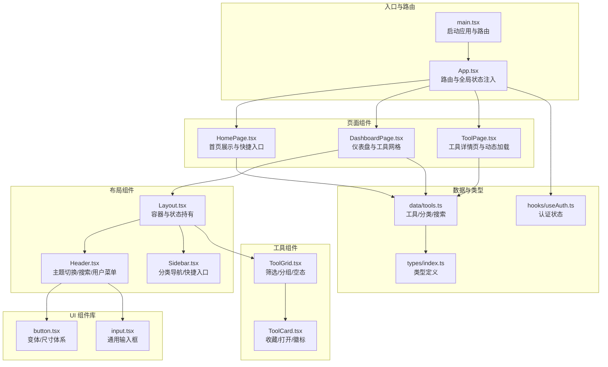
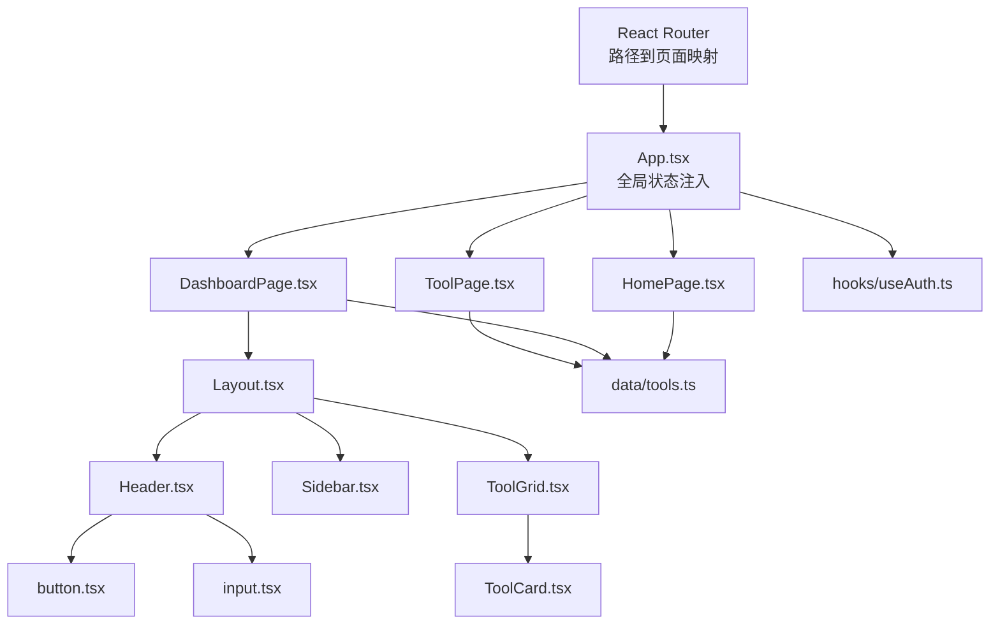
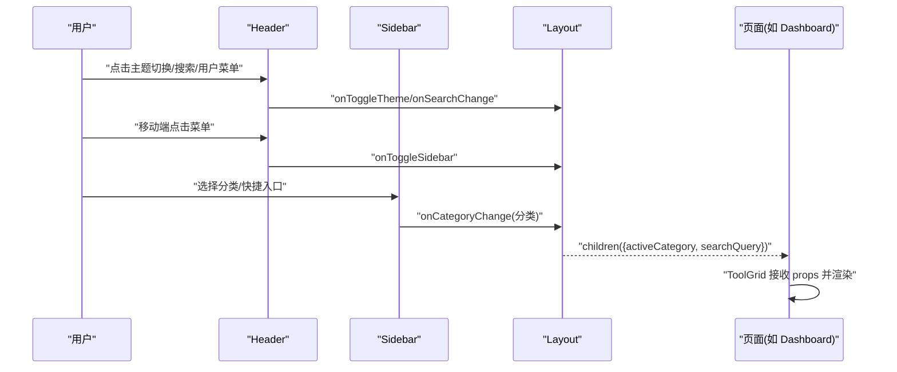
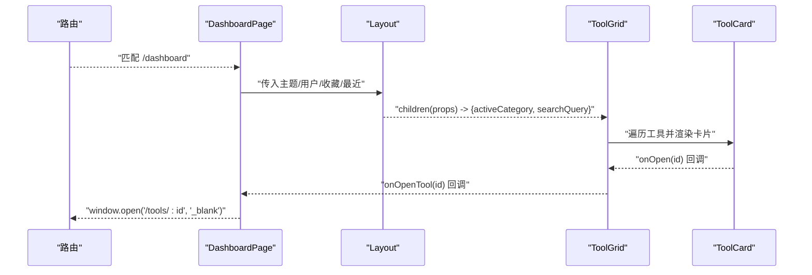
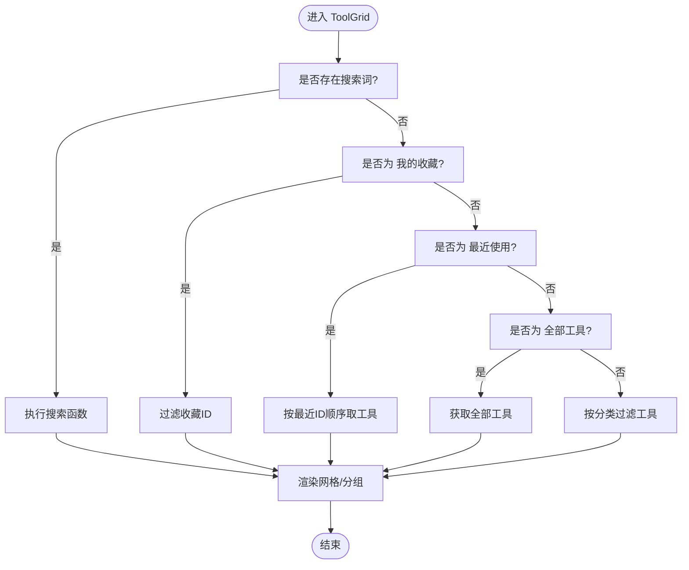
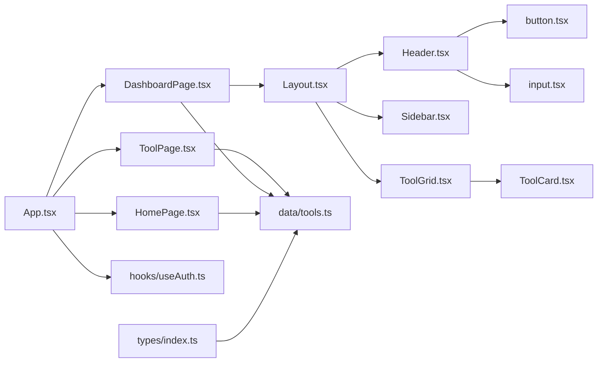

# 组件层次结构

<cite>
**本文引用的文件**
- [src/App.tsx](file://src/App.tsx)
- [src/main.tsx](file://src/main.tsx)
- [src/components/layout/Layout.tsx](file://src/components/layout/Layout.tsx)
- [src/components/layout/Header.tsx](file://src/components/layout/Header.tsx)
- [src/components/layout/Sidebar.tsx](file://src/components/layout/Sidebar.tsx)
- [src/pages/HomePage.tsx](file://src/pages/HomePage.tsx)
- [src/pages/DashboardPage.tsx](file://src/pages/DashboardPage.tsx)
- [src/pages/ToolPage.tsx](file://src/pages/ToolPage.tsx)
- [src/components/tools/ToolCard.tsx](file://src/components/tools/ToolCard.tsx)
- [src/components/tools/ToolGrid.tsx](file://src/components/tools/ToolGrid.tsx)
- [src/components/ui/button.tsx](file://src/components/ui/button.tsx)
- [src/components/ui/input.tsx](file://src/components/ui/input.tsx)
- [src/data/tools.ts](file://src/data/tools.ts)
- [src/types/index.ts](file://src/types/index.ts)
- [src/hooks/useAuth.ts](file://src/hooks/useAuth.ts)
</cite>

## 目录
1. [引言](#引言)
2. [项目结构](#项目结构)
3. [核心组件](#核心组件)
4. [架构总览](#架构总览)
5. [详细组件分析](#详细组件分析)
6. [依赖分析](#依赖分析)
7. [性能考虑](#性能考虑)
8. [故障排查指南](#故障排查指南)
9. [结论](#结论)
10. [附录](#附录)

## 引言
本文件系统性梳理 AnyTools 的组件层次结构，自上而下覆盖布局组件（Header、Sidebar、Layout）、页面组件（Home、Dashboard、Tool 等）以及工具组件（ToolCard、ToolGrid），并解释 UI 组件库（button、input 等）的设计理念与复用性。文档同时阐述组件间通信机制（props 传递、事件处理、状态共享策略），并提供使用示例与最佳实践建议。

## 项目结构
应用采用“路由驱动 + 组件分层”的组织方式：
- 入口与路由：通过根组件 App 与 main 中的 BrowserRouter 配置，按路径挂载不同页面组件。
- 页面层：HomePage、DashboardPage、ToolPage 等页面组件负责业务场景与数据聚合。
- 布局层：Layout 将 Header、Sidebar 与主内容区组合，提供统一的导航与筛选能力。
- 工具层：ToolGrid 负责工具列表的筛选与分组展示；ToolCard 提供单个工具卡片的统一交互。
- UI 层：button、input 等基础组件以可变样式与尺寸体系提供一致的视觉与交互体验。
- 数据与类型：tools.ts 提供工具与分类数据；types/index.ts 定义工具、分类与用户类型；hooks/useAuth.ts 提供认证状态与登录登出逻辑。

图表来源
- [src/main.tsx:1-14](file://src/main.tsx#L1-L14)
- [src/App.tsx:1-63](file://src/App.tsx#L1-L63)
- [src/pages/DashboardPage.tsx:1-50](file://src/pages/DashboardPage.tsx#L1-L50)
- [src/components/layout/Layout.tsx:1-70](file://src/components/layout/Layout.tsx#L1-L70)
- [src/components/layout/Header.tsx:1-159](file://src/components/layout/Header.tsx#L1-L159)
- [src/components/layout/Sidebar.tsx:1-181](file://src/components/layout/Sidebar.tsx#L1-L181)
- [src/components/tools/ToolGrid.tsx:1-136](file://src/components/tools/ToolGrid.tsx#L1-L136)
- [src/components/tools/ToolCard.tsx:1-66](file://src/components/tools/ToolCard.tsx#L1-L66)
- [src/components/ui/button.tsx:1-50](file://src/components/ui/button.tsx#L1-L50)
- [src/components/ui/input.tsx:1-25](file://src/components/ui/input.tsx#L1-L25)
- [src/data/tools.ts:1-316](file://src/data/tools.ts#L1-L316)
- [src/types/index.ts:1-37](file://src/types/index.ts#L1-L37)
- [src/hooks/useAuth.ts:1-89](file://src/hooks/useAuth.ts#L1-L89)

章节来源
- [src/main.tsx:1-14](file://src/main.tsx#L1-L14)
- [src/App.tsx:1-63](file://src/App.tsx#L1-L63)

## 核心组件
- 布局组件
  - Layout：集中持有侧边栏开关、活动分类、搜索词等状态，向子节点以 render props 形式传递控制参数，并协调 Header 与 Sidebar 的协作。
  - Header：提供主题切换、移动端侧边栏开关、全局搜索、用户菜单与版本日志入口。
  - Sidebar：提供首页、全部工具、我的收藏、最近使用、分类导航与管理入口等快捷通道。
- 页面组件
  - HomePage：首页展示、装饰元素与工具快捷入口。
  - DashboardPage：仪表盘页面，承载 Layout 并将筛选条件与收藏/最近状态传入 ToolGrid。
  - ToolPage：工具详情页，根据路由参数动态加载对应工具组件，记录使用日志。
- 工具组件
  - ToolGrid：根据 activeCategory 与 searchQuery 进行筛选与分组展示，支持空态提示。
  - ToolCard：统一的工具卡片交互，支持收藏切换、打开工具、徽标显示与键盘访问。
- UI 组件库
  - button：基于变体与尺寸的可配置按钮，支持多种视觉风格与尺寸。
  - input：通用输入框，具备聚焦态与禁用态的统一样式。

章节来源
- [src/components/layout/Layout.tsx:1-70](file://src/components/layout/Layout.tsx#L1-L70)
- [src/components/layout/Header.tsx:1-159](file://src/components/layout/Header.tsx#L1-L159)
- [src/components/layout/Sidebar.tsx:1-181](file://src/components/layout/Sidebar.tsx#L1-L181)
- [src/pages/HomePage.tsx:1-212](file://src/pages/HomePage.tsx#L1-L212)
- [src/pages/DashboardPage.tsx:1-50](file://src/pages/DashboardPage.tsx#L1-L50)
- [src/pages/ToolPage.tsx:1-113](file://src/pages/ToolPage.tsx#L1-L113)
- [src/components/tools/ToolGrid.tsx:1-136](file://src/components/tools/ToolGrid.tsx#L1-L136)
- [src/components/tools/ToolCard.tsx:1-66](file://src/components/tools/ToolCard.tsx#L1-L66)
- [src/components/ui/button.tsx:1-50](file://src/components/ui/button.tsx#L1-L50)
- [src/components/ui/input.tsx:1-25](file://src/components/ui/input.tsx#L1-L25)

## 架构总览
整体采用“布局容器 + 页面 + 工具网格 + 卡片”的分层设计，配合 UI 组件库实现一致的交互与视觉风格。路由层负责页面级切换，布局层负责导航与筛选，工具层负责数据筛选与展示，UI 层提供可复用的基础控件。

图表来源
- [src/App.tsx:1-63](file://src/App.tsx#L1-L63)
- [src/pages/DashboardPage.tsx:1-50](file://src/pages/DashboardPage.tsx#L1-L50)
- [src/components/layout/Layout.tsx:1-70](file://src/components/layout/Layout.tsx#L1-L70)
- [src/components/layout/Header.tsx:1-159](file://src/components/layout/Header.tsx#L1-L159)
- [src/components/layout/Sidebar.tsx:1-181](file://src/components/layout/Sidebar.tsx#L1-L181)
- [src/components/tools/ToolGrid.tsx:1-136](file://src/components/tools/ToolGrid.tsx#L1-L136)
- [src/components/tools/ToolCard.tsx:1-66](file://src/components/tools/ToolCard.tsx#L1-L66)
- [src/components/ui/button.tsx:1-50](file://src/components/ui/button.tsx#L1-L50)
- [src/components/ui/input.tsx:1-25](file://src/components/ui/input.tsx#L1-L25)
- [src/data/tools.ts:1-316](file://src/data/tools.ts#L1-L316)
- [src/hooks/useAuth.ts:1-89](file://src/hooks/useAuth.ts#L1-L89)

## 详细组件分析

### 布局组件：Header、Sidebar、Layout 的协作机制
- Header
  - 职责：主题切换、移动端侧边栏开关、全局搜索、用户菜单、版本日志入口。
  - 设计要点：使用外部数据源提供“开心一笑”跑马灯文案；搜索输入框支持清空；用户菜单支持管理员入口与退出登录。
- Sidebar
  - 职责：导航首页、全部工具、我的收藏、最近使用、分类目录与管理入口；根据当前路径高亮选中项；移动端遮罩与抽屉式展开。
  - 设计要点：通过 activeCategory 与 onCategoryChange 控制布局层的筛选状态；支持徽标显示收藏与最近数量。
- Layout
  - 职责：集中管理 sidebarOpen、activeCategory、searchQuery 状态；作为 render props 容器向下传递筛选条件；协调 Header 与 Sidebar 的协作。
  - 设计要点：children(props => ...) 模式将筛选状态暴露给子组件，避免多处重复逻辑。

图表来源
- [src/components/layout/Header.tsx:1-159](file://src/components/layout/Header.tsx#L1-L159)
- [src/components/layout/Sidebar.tsx:1-181](file://src/components/layout/Sidebar.tsx#L1-L181)
- [src/components/layout/Layout.tsx:1-70](file://src/components/layout/Layout.tsx#L1-L70)
- [src/pages/DashboardPage.tsx:1-50](file://src/pages/DashboardPage.tsx#L1-L50)

章节来源
- [src/components/layout/Header.tsx:1-159](file://src/components/layout/Header.tsx#L1-L159)
- [src/components/layout/Sidebar.tsx:1-181](file://src/components/layout/Sidebar.tsx#L1-L181)
- [src/components/layout/Layout.tsx:1-70](file://src/components/layout/Layout.tsx#L1-L70)

### 页面组件：Home、Dashboard、Tool 的职责与数据传递
- HomePage
  - 职责：首页展示、装饰元素、全球时钟、工具快捷入口。
  - 数据：从 data/tools.ts 获取 categories 与 tools，按分类分组展示快捷卡片。
- DashboardPage
  - 职责：仪表盘页面，承载 Layout 并将主题、用户、收藏、最近使用等状态传入 Layout。
  - 数据：接收 favorites、recentIds、onToggleFavorite、onOpenTool 等回调，用于收藏切换与打开工具。
- ToolPage
  - 职责：工具详情页，根据路由参数动态加载对应工具组件，记录使用日志。
  - 数据：从 data/tools.ts 获取工具元数据；通过懒加载与 Suspense 提升首屏性能。

图表来源
- [src/pages/DashboardPage.tsx:1-50](file://src/pages/DashboardPage.tsx#L1-L50)
- [src/components/layout/Layout.tsx:1-70](file://src/components/layout/Layout.tsx#L1-L70)
- [src/components/tools/ToolGrid.tsx:1-136](file://src/components/tools/ToolGrid.tsx#L1-L136)
- [src/components/tools/ToolCard.tsx:1-66](file://src/components/tools/ToolCard.tsx#L1-L66)
- [src/App.tsx:46-50](file://src/App.tsx#L46-L50)

章节来源
- [src/pages/HomePage.tsx:1-212](file://src/pages/HomePage.tsx#L1-L212)
- [src/pages/DashboardPage.tsx:1-50](file://src/pages/DashboardPage.tsx#L1-L50)
- [src/pages/ToolPage.tsx:1-113](file://src/pages/ToolPage.tsx#L1-L113)

### 工具组件：ToolCard 与 ToolGrid 的抽象设计
- ToolGrid
  - 职责：根据 activeCategory 与 searchQuery 进行筛选；当处于“全部工具”且无搜索时按分类分组展示；支持空态提示。
  - 策略：优先搜索，其次收藏，再最近使用，最后分类；分组时对每个分类单独渲染标题与网格。
- ToolCard
  - 职责：统一的工具卡片交互；支持收藏切换（防事件冒泡）、打开工具、徽标显示（NEW/HOT）与键盘访问。
  - 交互：点击卡片主体触发打开；收藏按钮独立处理事件；悬停与键盘 Enter 支持激活。

图表来源
- [src/components/tools/ToolGrid.tsx:15-109](file://src/components/tools/ToolGrid.tsx#L15-L109)
- [src/data/tools.ts:303-316](file://src/data/tools.ts#L303-L316)

章节来源
- [src/components/tools/ToolGrid.tsx:1-136](file://src/components/tools/ToolGrid.tsx#L1-L136)
- [src/components/tools/ToolCard.tsx:1-66](file://src/components/tools/ToolCard.tsx#L1-L66)

### UI 组件库：button、input 的复用性与可定制性
- button
  - 设计：基于变体（variant）与尺寸（size）的可配置体系，支持默认、破坏性、描边、次级、幽灵、链接与 Premium 等风格。
  - 可定制：通过类名合并与透传属性实现外观与行为的灵活扩展。
- input
  - 设计：统一的输入框样式，支持聚焦态、禁用态与占位符样式，便于在表单与搜索场景复用。

章节来源
- [src/components/ui/button.tsx:1-50](file://src/components/ui/button.tsx#L1-L50)
- [src/components/ui/input.tsx:1-25](file://src/components/ui/input.tsx#L1-L25)

### 组件间通信机制
- Props 传递
  - App 向页面组件传递主题、用户、收藏、最近使用与回调；页面组件向 Layout 传递状态；Layout 向 ToolGrid 传递筛选条件。
- 事件处理
  - Header 与 Sidebar 通过回调更新 Layout 内部状态；ToolCard 触发 onOpen 回调；收藏按钮独立处理事件并阻止冒泡。
- 状态共享策略
  - 全局状态：useAuth 在 App 中初始化并向下传递；本地存储用于持久化用户与最近使用记录。
  - 局部状态：Layout 使用 useState 管理侧边栏、分类与搜索词；ToolGrid 根据 props 动态筛选与渲染。

章节来源
- [src/App.tsx:12-60](file://src/App.tsx#L12-L60)
- [src/hooks/useAuth.ts:1-89](file://src/hooks/useAuth.ts#L1-L89)
- [src/components/layout/Layout.tsx:20-69](file://src/components/layout/Layout.tsx#L20-L69)
- [src/components/tools/ToolCard.tsx:24-43](file://src/components/tools/ToolCard.tsx#L24-L43)

## 依赖分析
- 组件耦合
  - 页面组件依赖布局组件与工具组件；工具组件依赖数据层与类型定义；UI 组件被广泛复用。
- 外部依赖
  - 路由：react-router-dom；图标：lucide-react；样式：Tailwind CSS；类型：LucideIcon。
- 循环依赖
  - 当前结构未发现循环依赖；数据与类型分离清晰。

图表来源
- [src/App.tsx:1-63](file://src/App.tsx#L1-L63)
- [src/pages/DashboardPage.tsx:1-50](file://src/pages/DashboardPage.tsx#L1-L50)
- [src/components/layout/Layout.tsx:1-70](file://src/components/layout/Layout.tsx#L1-L70)
- [src/components/layout/Header.tsx:1-159](file://src/components/layout/Header.tsx#L1-L159)
- [src/components/layout/Sidebar.tsx:1-181](file://src/components/layout/Sidebar.tsx#L1-L181)
- [src/components/tools/ToolGrid.tsx:1-136](file://src/components/tools/ToolGrid.tsx#L1-L136)
- [src/components/tools/ToolCard.tsx:1-66](file://src/components/tools/ToolCard.tsx#L1-L66)
- [src/components/ui/button.tsx:1-50](file://src/components/ui/button.tsx#L1-L50)
- [src/components/ui/input.tsx:1-25](file://src/components/ui/input.tsx#L1-L25)
- [src/data/tools.ts:1-316](file://src/data/tools.ts#L1-L316)
- [src/types/index.ts:1-37](file://src/types/index.ts#L1-L37)
- [src/hooks/useAuth.ts:1-89](file://src/hooks/useAuth.ts#L1-L89)

章节来源
- [src/data/tools.ts:1-316](file://src/data/tools.ts#L1-L316)
- [src/types/index.ts:1-37](file://src/types/index.ts#L1-L37)

## 性能考虑
- 懒加载与分割：ToolPage 对工具组件进行动态导入与 Suspense 包裹，降低首屏包体与提升交互流畅度。
- 列表渲染优化：ToolGrid 在“全部工具 + 无搜索”场景按分类分组渲染，减少单一长列表的重排压力。
- 事件冒泡控制：ToolCard 收藏按钮内部处理事件并阻止冒泡，避免不必要的父级重渲染。
- 本地缓存：useAuth 通过本地存储持久化用户信息与最近使用记录，减少重复请求与刷新抖动。

## 故障排查指南
- 登录失败
  - 现象：登录接口返回错误或网络异常。
  - 排查：检查 useAuth 的登录流程与错误状态；确认 API 基础地址与接口返回格式。
- 工具未找到
  - 现象：ToolPage 无法匹配到工具 ID。
  - 排查：核对 data/tools.ts 中的工具 id 与路由参数是否一致；确认工具组件是否已注册到懒加载映射。
- 收藏/最近状态不同步
  - 现象：收藏切换无效或最近使用不更新。
  - 排查：确认 DashboardPage 传入的 onToggleFavorite 与 onOpenTool 回调是否正确；检查本地存储键值是否被清理。

章节来源
- [src/hooks/useAuth.ts:37-83](file://src/hooks/useAuth.ts#L37-L83)
- [src/pages/ToolPage.tsx:40-61](file://src/pages/ToolPage.tsx#L40-L61)
- [src/App.tsx:46-50](file://src/App.tsx#L46-L50)

## 结论
AnyTools 的组件层次结构清晰、职责分明：布局组件提供统一导航与筛选，页面组件承载业务场景，工具组件实现数据筛选与展示，UI 组件库保证一致的交互体验。通过 props 与回调的组合，组件间形成低耦合、高内聚的协作关系；结合懒加载与本地存储，兼顾了性能与可用性。建议在后续迭代中进一步完善类型约束与错误边界，持续优化交互细节与可访问性。

## 附录
- 组件使用示例与最佳实践
  - 布局容器：在页面组件中引入 Layout，并通过 children(props) 获取 activeCategory 与 searchQuery，避免在多个地方重复维护筛选逻辑。
  - 工具卡片：ToolCard 提供统一的收藏与打开交互，建议在上层组件中集中处理收藏状态与最近使用记录。
  - UI 组件：button 与 input 应遵循变体与尺寸规范，在表单与按钮场景中保持一致的视觉与交互。
  - 路由与懒加载：ToolPage 的动态导入与 Suspense 是推荐的性能优化实践，建议为所有重型工具组件采用相同策略。