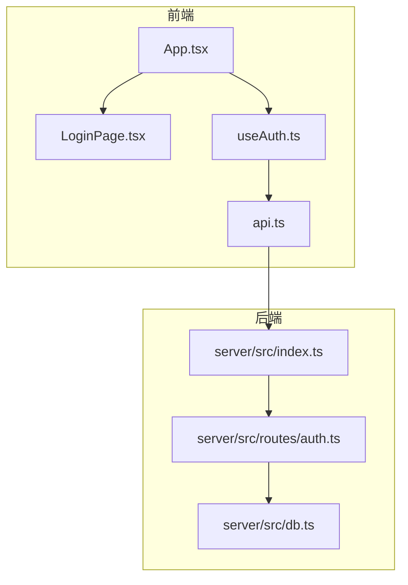
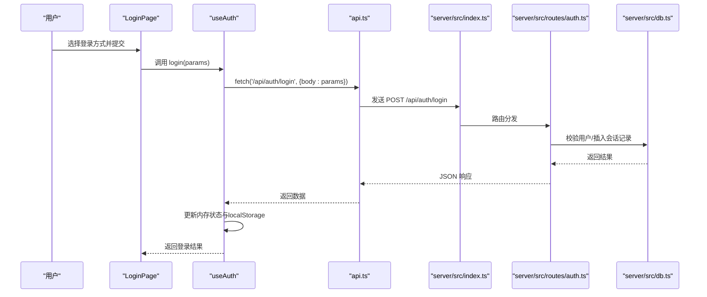
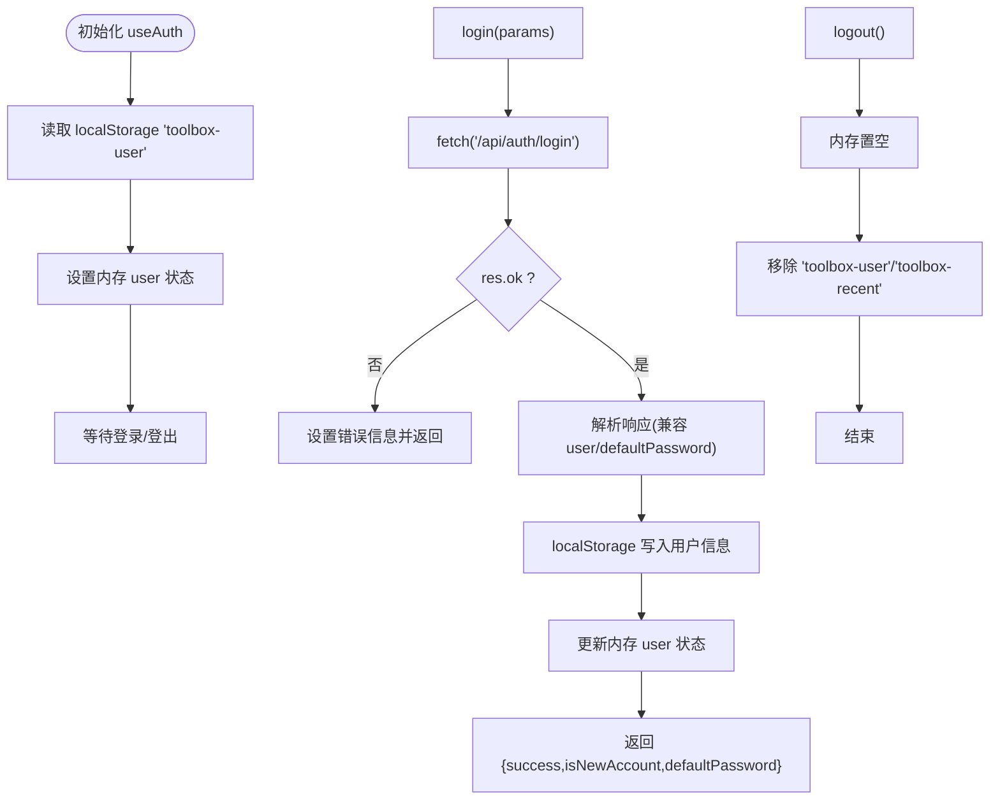
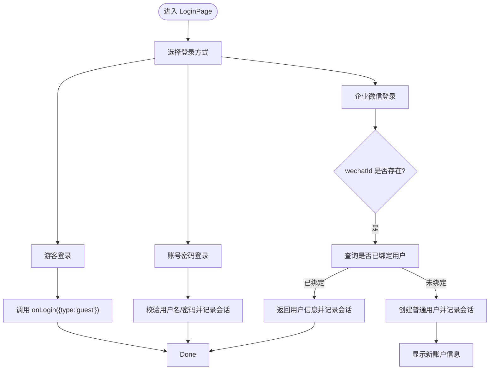
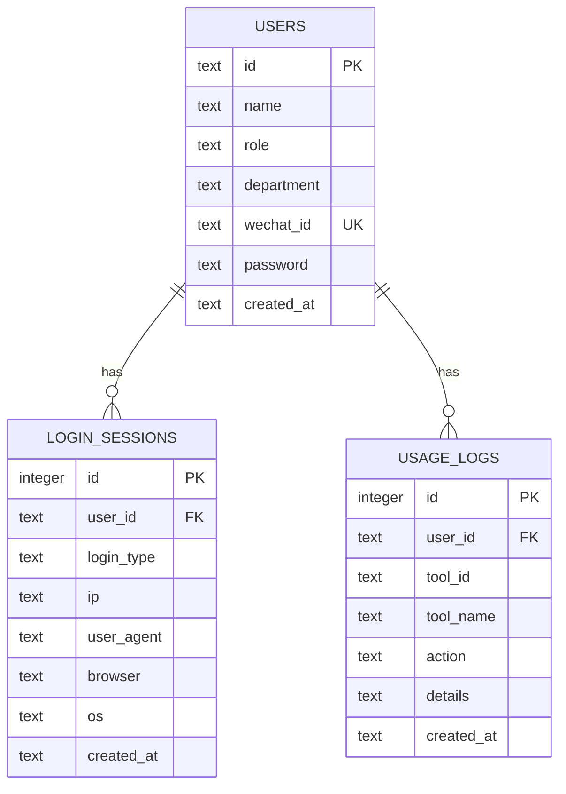
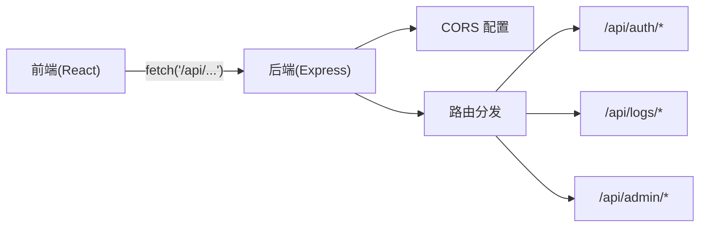
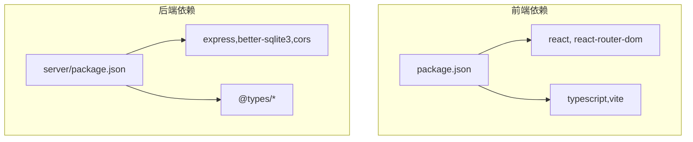

# 会话管理

<cite>
**本文引用的文件**
- [useAuth.ts](file://src/hooks/useAuth.ts)
- [LoginPage.tsx](file://src/pages/LoginPage.tsx)
- [App.tsx](file://src/App.tsx)
- [api.ts](file://src/lib/api.ts)
- [auth.ts](file://server/src/routes/auth.ts)
- [db.ts](file://server/src/db.ts)
- [index.ts](file://server/src/index.ts)
- [types.ts](file://server/src/types.ts)
- [index.ts](file://server/package.json)
- [index.ts](file://package.json)
</cite>

## 目录
1. [简介](#简介)
2. [项目结构](#项目结构)
3. [核心组件](#核心组件)
4. [架构总览](#架构总览)
5. [详细组件分析](#详细组件分析)
6. [依赖关系分析](#依赖关系分析)
7. [性能考量](#性能考量)
8. [故障排除指南](#故障排除指南)
9. [结论](#结论)

## 简介
本文件系统性梳理该工具门户的会话管理机制，覆盖用户会话的创建、维护与销毁；解释 token 的生成、存储与有效期管理；阐述前后端会话状态同步（本地存储与内存状态）；说明会话过期处理、自动续期与安全注销流程；并给出 CSRF、XSS、会话劫持等安全防护建议及调试排障方法。

## 项目结构
该工程采用前后端分离：前端为 React 应用，通过 /api 前缀调用后端 Express 服务；后端基于 better-sqlite3 存储用户、会话与日志数据。会话状态在前端以 localStorage 持久化，在内存中由 React Hook 管理；后端记录登录来源信息用于审计。



**图表来源**
- [App.tsx:12-60](file://src/App.tsx#L12-L60)
- [LoginPage.tsx:22-249](file://src/pages/LoginPage.tsx#L22-L249)
- [useAuth.ts:20-87](file://src/hooks/useAuth.ts#L20-L87)
- [api.ts:1-35](file://src/lib/api.ts#L1-L35)
- [index.ts:10-22](file://server/src/index.ts#L10-L22)
- [auth.ts:36-106](file://server/src/routes/auth.ts#L36-L106)
- [db.ts:62-75](file://server/src/db.ts#L62-L75)

**章节来源**
- [App.tsx:12-60](file://src/App.tsx#L12-L60)
- [index.ts:10-22](file://server/src/index.ts#L10-L22)

## 核心组件
- 前端会话钩子：负责登录、登出、用户状态持久化与新账户提示。
- 登录页面：提供游客、账号密码、企业微信三种登录方式。
- 后端认证路由：处理登录请求、校验凭据、记录会话来源。
- 数据库：存储用户、会话与使用日志，支持登录来源审计。
- API 封装：统一 /api 前缀的请求封装。

**章节来源**
- [useAuth.ts:20-87](file://src/hooks/useAuth.ts#L20-L87)
- [LoginPage.tsx:22-249](file://src/pages/LoginPage.tsx#L22-L249)
- [auth.ts:36-106](file://server/src/routes/auth.ts#L36-L106)
- [db.ts:62-75](file://server/src/db.ts#L62-L75)
- [api.ts:1-35](file://src/lib/api.ts#L1-L35)

## 架构总览
前端通过 useAuth 统一管理会话状态，登录成功后将用户对象写入 localStorage 并更新内存状态；后端在 /api/auth/login 接口完成凭据校验与会话记录；所有 API 请求均以 /api 前缀访问后端。



**图表来源**
- [LoginPage.tsx:30-40](file://src/pages/LoginPage.tsx#L30-L40)
- [useAuth.ts:37-72](file://src/hooks/useAuth.ts#L37-L72)
- [api.ts:27-35](file://src/lib/api.ts#L27-L35)
- [index.ts:17](file://server/src/index.ts#L17)
- [auth.ts:36-106](file://server/src/routes/auth.ts#L36-L106)
- [db.ts:62-75](file://server/src/db.ts#L62-L75)

## 详细组件分析

### 前端会话管理（useAuth）
- 初始化：从 localStorage 恢复用户状态，避免刷新丢失。
- 登录流程：发起 /api/auth/login，根据响应格式兼容处理，成功后写入 localStorage 并更新内存状态；若为新账户，返回默认密码提示。
- 登出流程：清空内存与 localStorage 中的用户信息，并清理最近访问列表。
- 用户列表：启动时拉取用户列表，供管理员界面使用。



**图表来源**
- [useAuth.ts:20-87](file://src/hooks/useAuth.ts#L20-L87)

**章节来源**
- [useAuth.ts:20-87](file://src/hooks/useAuth.ts#L20-L87)

### 登录页面（LoginPage）
- 提供三种登录方式：游客、账号密码、企业微信。
- 游客登录：直接生成临时访客标识并记录会话。
- 企业微信登录：若 wechatId 已绑定用户则直接登录，否则自动创建普通用户并绑定。
- 账号密码登录：按名称或 ID 查找用户，密码字段为空时回退到用户 ID 校验。
- 新账户提示：首次企业微信登录时展示账号与默认密码，支持复制。



**图表来源**
- [LoginPage.tsx:22-249](file://src/pages/LoginPage.tsx#L22-L249)
- [auth.ts:46-103](file://server/src/routes/auth.ts#L46-L103)

**章节来源**
- [LoginPage.tsx:22-249](file://src/pages/LoginPage.tsx#L22-L249)
- [auth.ts:46-103](file://server/src/routes/auth.ts#L46-L103)

### 后端认证路由（/api/auth）
- 客户端信息采集：从请求头提取 IP、User-Agent，并简单识别浏览器与操作系统。
- 会话记录：每次登录成功后向 login_sessions 表插入一条记录，包含登录类型、IP、UA、浏览器、系统等信息。
- 登录逻辑：
  - 游客：生成 guest-{timestamp} 标识并返回。
  - 企业微信：若 wechatId 已绑定用户则直接登录，否则创建普通用户并返回默认密码与新账户标记。
  - 账号密码：按名称或 ID 查找用户，密码为空则回退到用户 ID 校验。
  - 兼容旧参数：支持仅传 userId 的场景。

```mermaid
flowchart TD
Req["POST /api/auth/login"] --> Type{"type?"}
Type --> |guest| Guest["生成 guest 标识并记录会话"]
Type --> |wechat| WeChat["校验/创建用户并记录会话"]
Type --> |password| Pass["校验用户名/密码并记录会话"]
Type --> |legacy(userId)| Legacy["按 userId 查询并记录会话"]
Guest --> Resp["返回用户信息(JSON)"]
WeChat --> Resp
Pass --> Resp
Legacy --> Resp
```

**图表来源**
- [auth.ts:36-106](file://server/src/routes/auth.ts#L36-L106)
- [db.ts:62-75](file://server/src/db.ts#L62-L75)

**章节来源**
- [auth.ts:7-29](file://server/src/routes/auth.ts#L7-L29)
- [auth.ts:36-106](file://server/src/routes/auth.ts#L36-L106)
- [db.ts:62-75](file://server/src/db.ts#L62-L75)

### 数据模型与表结构
- users：用户基本信息、角色、部门、微信 ID、密码等。
- login_sessions：登录会话记录，包含用户 ID、登录类型、IP、UA、浏览器、系统、创建时间。
- usage_logs：使用日志，用于审计与统计。



**图表来源**
- [db.ts:14-75](file://server/src/db.ts#L14-L75)
- [types.ts:36-45](file://server/src/types.ts#L36-L45)

**章节来源**
- [db.ts:14-75](file://server/src/db.ts#L14-L75)
- [types.ts:36-45](file://server/src/types.ts#L36-L45)

### API 路由与跨域配置
- 前端统一通过 /api 前缀访问后端接口。
- 后端启用 CORS，允许指定来源或通配符。
- 健康检查 /api/health 返回服务状态。



**图表来源**
- [index.ts:10-26](file://server/src/index.ts#L10-L26)
- [index.ts:17-22](file://server/src/index.ts#L17-L22)

**章节来源**
- [index.ts:10-26](file://server/src/index.ts#L10-L26)
- [index.ts:17-22](file://server/src/index.ts#L17-L22)

## 依赖关系分析
- 前端依赖 React、react-router-dom、lucide-react 等；构建工具为 Vite + TypeScript。
- 后端依赖 Express、better-sqlite3、cors；开发依赖 tsx、@types/*。
- 前端通过 api.ts 统一封装 /api 请求；后端在 index.ts 注册各模块路由。



**图表来源**
- [index.ts:1-34](file://package.json#L1-L34)
- [index.ts:1-23](file://server/package.json#L1-L23)

**章节来源**
- [index.ts:1-34](file://package.json#L1-L34)
- [index.ts:1-23](file://server/package.json#L1-L23)

## 性能考量
- 前端：useAuth 在初始化时进行一次 localStorage 读取，避免重复 IO；登录与登出操作均为 O(1) 级别。
- 后端：数据库使用 WAL 模式与外键约束，索引覆盖 users.wechat_id、sessions.user_id、sessions.created_at 等，有利于登录与审计查询。
- 网络：后端限制 JSON 体大小为 5MB，避免异常负载；CORS 放宽至通配符，便于开发阶段调试。

[本节为通用性能讨论，不涉及具体文件分析]

## 故障排除指南
- 登录无响应或报错
  - 检查后端 /api/auth/login 是否可达，确认 CORS 配置与来源白名单。
  - 查看浏览器网络面板与后端控制台日志。
  - 参考路径：[index.ts:14-16](file://server/src/index.ts#L14-L16)，[auth.ts:36-106](file://server/src/routes/auth.ts#L36-L106)
- 登录成功但页面未跳转
  - 确认 useAuth.login 成功后是否正确更新内存状态与 localStorage。
  - 参考路径：[useAuth.ts:58-59](file://src/hooks/useAuth.ts#L58-L59)
- 新企业微信账户未显示默认密码
  - 确认后端返回包含 isNewAccount 与 defaultPassword 字段。
  - 参考路径：[auth.ts:77-81](file://server/src/routes/auth.ts#L77-L81)，[useAuth.ts:61-63](file://src/hooks/useAuth.ts#L61-L63)
- 登出后仍显示登录态
  - 确认 useAuth.logout 是否移除了 localStorage 中的用户信息与最近访问列表。
  - 参考路径：[useAuth.ts:74-79](file://src/hooks/useAuth.ts#L74-L79)
- 会话来源信息缺失
  - 确认客户端是否正确传递 IP 与 UA 头，后端是否正确解析。
  - 参考路径：[auth.ts:7-29](file://server/src/routes/auth.ts#L7-L29)，[db.ts:62-75](file://server/src/db.ts#L62-L75)

**章节来源**
- [index.ts:14-16](file://server/src/index.ts#L14-L16)
- [auth.ts:36-106](file://server/src/routes/auth.ts#L36-L106)
- [useAuth.ts:58-59](file://src/hooks/useAuth.ts#L58-L59)
- [auth.ts:77-81](file://server/src/routes/auth.ts#L77-L81)
- [useAuth.ts:74-79](file://src/hooks/useAuth.ts#L74-L79)
- [auth.ts:7-29](file://server/src/routes/auth.ts#L7-L29)
- [db.ts:62-75](file://server/src/db.ts#L62-L75)

## 结论
当前实现采用“轻量级会话”模式：前端以 localStorage 持久化用户对象，后端不颁发专用 token，登录成功即建立会话并记录来源信息。该方案简单可靠，适合内部工具门户场景。若未来需要更强的安全性与跨域/多端能力，可引入 JWT 或 Cookie 会话，并配套 CSRF/XSS/会话劫持防护策略。