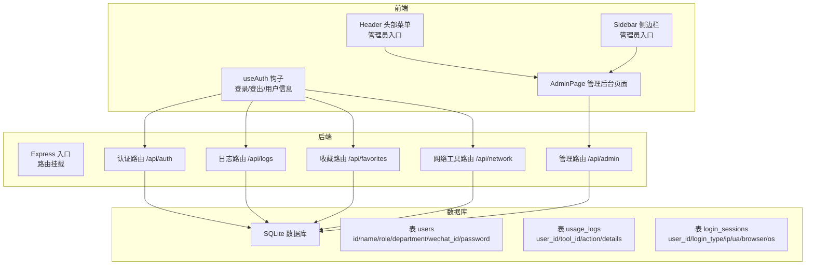
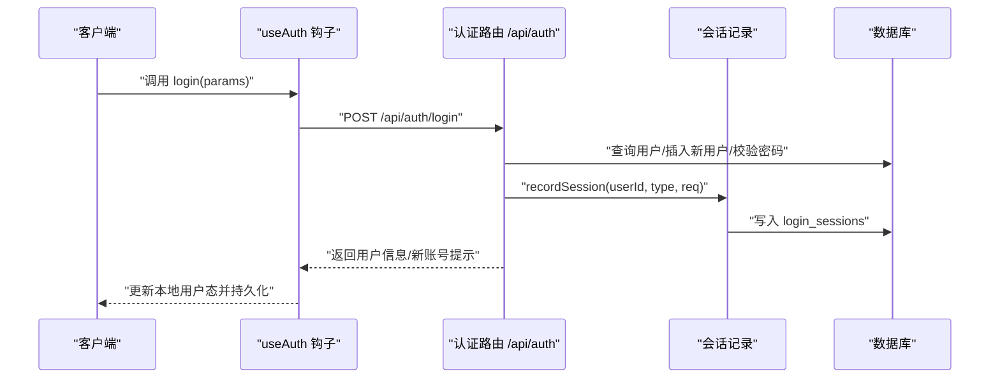
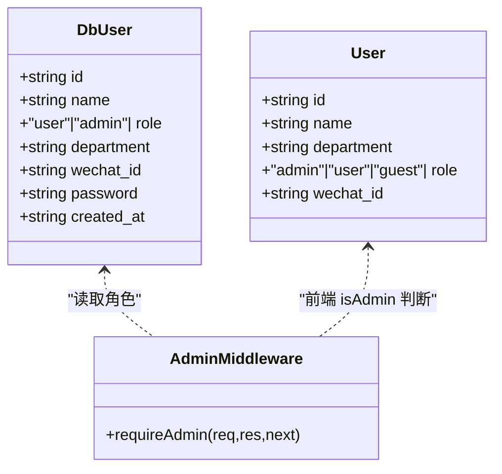
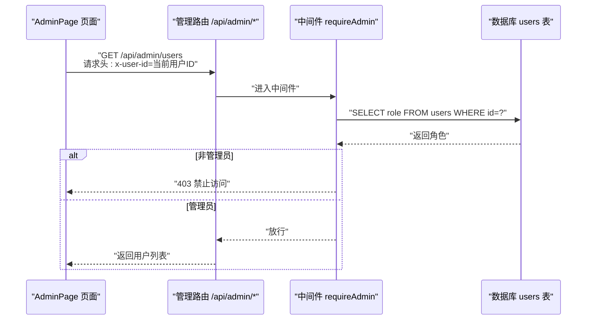
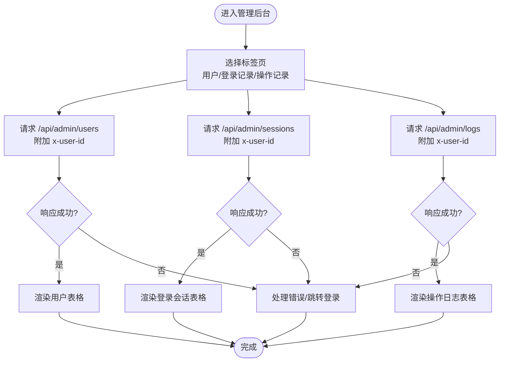
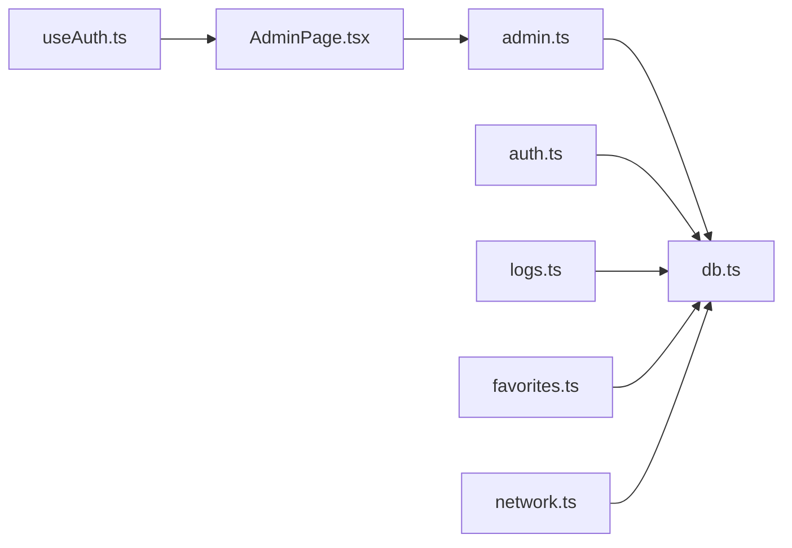

# 权限系统

<cite>
**本文引用的文件**
- [server/src/index.ts](file://server/src/index.ts)
- [server/src/db.ts](file://server/src/db.ts)
- [server/src/types.ts](file://server/src/types.ts)
- [server/src/routes/admin.ts](file://server/src/routes/admin.ts)
- [server/src/routes/auth.ts](file://server/src/routes/auth.ts)
- [server/src/routes/logs.ts](file://server/src/routes/logs.ts)
- [server/src/routes/favorites.ts](file://server/src/routes/favorites.ts)
- [server/src/routes/network.ts](file://server/src/routes/network.ts)
- [src/hooks/useAuth.ts](file://src/hooks/useAuth.ts)
- [src/pages/AdminPage.tsx](file://src/pages/AdminPage.tsx)
- [src/components/layout/Header.tsx](file://src/components/layout/Header.tsx)
- [src/components/layout/Sidebar.tsx](file://src/components/layout/Sidebar.tsx)
- [src/types/index.ts](file://src/types/index.ts)
</cite>

## 目录
1. [简介](#简介)
2. [项目结构](#项目结构)
3. [核心组件](#核心组件)
4. [架构总览](#架构总览)
5. [详细组件分析](#详细组件分析)
6. [依赖分析](#依赖分析)
7. [性能考量](#性能考量)
8. [故障排查指南](#故障排查指南)
9. [结论](#结论)
10. [附录](#附录)

## 简介
本文件系统化梳理权限管理子系统，覆盖角色与权限模型、访问控制机制、中间件实现、管理员后台保护策略、配置最佳实践、安全变更注意事项以及扩展性设计建议。文档同时提供可视化图示与排障指引，帮助开发者与运维人员快速定位与解决权限相关问题。

## 项目结构
权限系统由“前端状态与UI”、“后端路由与中间件”、“数据库模型与审计日志”三层组成。前端通过自定义 Hook 维护用户态与登录流程；后端以 Express 路由承载认证与权限控制；数据库采用 SQLite 并内置审计表与会话表。

图表来源
- [server/src/index.ts:1-31](file://server/src/index.ts#L1-L31)
- [server/src/routes/admin.ts:1-93](file://server/src/routes/admin.ts#L1-L93)
- [server/src/routes/auth.ts:1-109](file://server/src/routes/auth.ts#L1-L109)
- [server/src/routes/logs.ts:1-134](file://server/src/routes/logs.ts#L1-L134)
- [server/src/routes/favorites.ts:1-31](file://server/src/routes/favorites.ts#L1-L31)
- [server/src/routes/network.ts:1-109](file://server/src/routes/network.ts#L1-L109)
- [server/src/db.ts:12-75](file://server/src/db.ts#L12-L75)

章节来源
- [server/src/index.ts:1-31](file://server/src/index.ts#L1-L31)
- [server/src/db.ts:12-75](file://server/src/db.ts#L12-L75)

## 核心组件
- 角色与数据模型
  - 用户角色：支持“普通用户”和“管理员”，数据库层以枚举约束保证取值合法。
  - 用户实体：包含标识、名称、角色、部门、微信绑定、密码等字段。
  - 审计与会话：提供登录会话记录与使用日志，便于审计与追踪。
- 前端用户态与鉴权
  - useAuth 提供登录、登出、本地存储持久化、新账号提示等能力。
  - Header/Sidebar 根据 isAdmin 渲染管理员入口。
- 后端中间件与路由
  - 管理员中间件 requireAdmin 通过请求头携带的用户ID校验角色。
  - 管理路由仅对管理员开放，提供用户管理、登录会话查询、全量操作日志查询。
  - 认证路由支持多种登录方式并记录会话信息。
  - 日志路由提供用户使用日志的创建与查询接口。

章节来源
- [server/src/types.ts:1-46](file://server/src/types.ts#L1-L46)
- [src/types/index.ts:29-36](file://src/types/index.ts#L29-L36)
- [src/hooks/useAuth.ts:20-89](file://src/hooks/useAuth.ts#L20-L89)
- [src/pages/AdminPage.tsx:55-106](file://src/pages/AdminPage.tsx#L55-L106)
- [server/src/routes/admin.ts:7-14](file://server/src/routes/admin.ts#L7-L14)
- [server/src/routes/admin.ts:18-90](file://server/src/routes/admin.ts#L18-L90)
- [server/src/routes/auth.ts:36-106](file://server/src/routes/auth.ts#L36-L106)
- [server/src/routes/logs.ts:7-69](file://server/src/routes/logs.ts#L7-L69)

## 架构总览
权限系统遵循“前端用户态 + 后端中间件 + 数据库审计”的分层设计。管理员后台通过统一的中间件保护，所有敏感操作均需具备管理员角色。登录流程贯穿会话记录与审计日志，确保可追溯。

图表来源
- [src/hooks/useAuth.ts:37-72](file://src/hooks/useAuth.ts#L37-L72)
- [server/src/routes/auth.ts:24-29](file://server/src/routes/auth.ts#L24-L29)
- [server/src/routes/auth.ts:36-106](file://server/src/routes/auth.ts#L36-L106)
- [server/src/db.ts:62-75](file://server/src/db.ts#L62-L75)

## 详细组件分析

### 角色定义与权限边界
- 角色模型
  - 后端 users 表的 role 字段受约束，仅允许“user”或“admin”。
  - 前端类型中存在“guest”角色，用于登录流程中的访客场景，但不参与管理员后台的权限判定。
- 权限边界
  - 管理员后台（/api/admin/*）仅对 role 为“admin”的用户开放。
  - 前端 Header/Sidebar 在检测到 isAdmin 时才显示管理入口。

图表来源
- [server/src/types.ts:1-9](file://server/src/types.ts#L1-L9)
- [src/types/index.ts:29-36](file://src/types/index.ts#L29-L36)
- [server/src/routes/admin.ts:7-14](file://server/src/routes/admin.ts#L7-L14)

章节来源
- [server/src/types.ts:1-9](file://server/src/types.ts#L1-L9)
- [src/types/index.ts:29-36](file://src/types/index.ts#L29-L36)
- [server/src/routes/admin.ts:7-14](file://server/src/routes/admin.ts#L7-L14)

### 权限验证中间件与路由级控制
- 中间件实现
  - requireAdmin 从请求头 x-user-id 获取当前用户ID，查询数据库 users 表，若不存在或非 admin 则拒绝访问。
- 路由级保护
  - /api/admin/users 的 GET/POST/PUT/DELETE 均前置 requireAdmin。
  - /api/admin/sessions 与 /api/admin/logs 亦受 requireAdmin 保护。
- 前端请求
  - 管理后台页面在发起 /api/admin/* 请求时，统一附加 x-user-id 请求头，确保后端能正确识别调用者身份。

图表来源
- [src/pages/AdminPage.tsx:75-81](file://src/pages/AdminPage.tsx#L75-L81)
- [server/src/routes/admin.ts:7-14](file://server/src/routes/admin.ts#L7-L14)
- [server/src/routes/admin.ts:18-22](file://server/src/routes/admin.ts#L18-L22)

章节来源
- [server/src/routes/admin.ts:7-14](file://server/src/routes/admin.ts#L7-L14)
- [src/pages/AdminPage.tsx:75-100](file://src/pages/AdminPage.tsx#L75-L100)

### 功能级权限控制与最小暴露原则
- 当前实现
  - 管理员后台是唯一具备跨用户视角与敏感操作的入口，其余路由未强制要求管理员角色。
  - 收藏、日志、网络工具等路由未做角色校验，遵循“按需最小权限”原则。
- 建议
  - 对涉及用户隐私或系统资源的操作，建议引入细粒度权限位或基于角色的功能开关，避免“全有或全无”的粗放式 admin 判定。

章节来源
- [server/src/routes/favorites.ts:1-31](file://server/src/routes/favorites.ts#L1-L31)
- [server/src/routes/logs.ts:1-134](file://server/src/routes/logs.ts#L1-L134)
- [server/src/routes/network.ts:1-109](file://server/src/routes/network.ts#L1-L109)

### 管理员后台的保护机制
- 路由保护
  - 所有 /api/admin/* 路由均受 requireAdmin 保护。
- 数据访问
  - 用户管理：支持查询、新增、修改、删除；新增默认密码回退为用户ID，便于首次登录。
  - 登录会话：分页查询，支持关键字过滤，展示来源 IP、浏览器、操作系统等信息。
  - 使用日志：分页查询，支持关键字过滤，展示用户、工具、动作、详情与时间。
- 前端呈现
  - Header/Sidebar 在管理员登录时显示“管理后台”入口。
  - AdminPage 内部根据标签页切换加载不同数据，统一附加 x-user-id 请求头。

图表来源
- [src/pages/AdminPage.tsx:55-106](file://src/pages/AdminPage.tsx#L55-L106)
- [server/src/routes/admin.ts:18-90](file://server/src/routes/admin.ts#L18-L90)

章节来源
- [src/pages/AdminPage.tsx:55-106](file://src/pages/AdminPage.tsx#L55-L106)
- [server/src/routes/admin.ts:18-90](file://server/src/routes/admin.ts#L18-L90)

### 敏感操作的二次确认与操作审计
- 二次确认
  - 删除用户操作前弹窗确认，降低误删风险。
- 操作审计
  - 登录会话记录：记录登录来源、UA、浏览器、系统等信息，便于追踪异常登录。
  - 使用日志：记录用户、工具、动作、详情与时间，支持关键字检索与分页。
- 建议
  - 对高危操作（如批量删除、角色提升）增加二次确认与短信/邮件提醒。
  - 将审计日志导出为 CSV 或接入 SIEM 系统，满足合规要求。

章节来源
- [src/pages/AdminPage.tsx:122-129](file://src/pages/AdminPage.tsx#L122-L129)
- [server/src/routes/auth.ts:24-29](file://server/src/routes/auth.ts#L24-L29)
- [server/src/routes/logs.ts:7-69](file://server/src/routes/logs.ts#L7-L69)
- [server/src/db.ts:62-75](file://server/src/db.ts#L62-L75)

### 权限配置最佳实践
- 角色与权限
  - 明确“管理员”职责边界，避免赋予过多全局权限。
  - 引入“只读管理员”或“运营管理员”等细分角色，配合功能开关。
- 密码与会话
  - 新建用户默认密码回退为用户ID，建议引导用户尽快修改。
  - 登录会话记录应保留合理周期，定期清理过期会话。
- 接口与中间件
  - 对所有写操作路由统一前置中间件校验。
  - 对跨用户查询接口（如 /api/admin/logs）严格限制分页参数范围。
- 前端
  - 仅在 isAdmin 为真时渲染管理入口，避免信息泄露。
  - 对高风险操作（删除、修改角色）增加确认对话框。

章节来源
- [server/src/routes/admin.ts:24-49](file://server/src/routes/admin.ts#L24-L49)
- [server/src/routes/auth.ts:66-82](file://server/src/routes/auth.ts#L66-L82)
- [server/src/routes/admin.ts:69-90](file://server/src/routes/admin.ts#L69-L90)

### 权限变更的安全考虑
- 变更流程
  - 管理员角色变更需双人复核与审计日志留痕。
  - 批量导入用户时，校验字段完整性与角色合法性。
- 运行时安全
  - 严格限制 /api/admin/* 的调用来源与频率，防止暴力尝试。
  - 对 x-user-id 请求头进行白名单校验（生产环境建议由网关或反向代理注入）。
- 数据保护
  - 审计日志与会话信息脱敏存储，避免泄露敏感字段。
  - 定期备份数据库并验证恢复流程。

章节来源
- [server/src/routes/admin.ts:18-90](file://server/src/routes/admin.ts#L18-L90)
- [server/src/db.ts:62-75](file://server/src/db.ts#L62-L75)

### 权限系统的扩展性设计
- 角色扩展
  - 在 users 表 role 字段基础上，可引入多角色组合或角色继承链。
- 权限位扩展
  - 新增 permissions JSON 字段，记录细粒度权限位，后端按位校验。
- 功能开关
  - 引入 feature_flags 表，按用户/租户维度启用/禁用功能。
- 中间件增强
  - requireAdmin 可升级为 requirePermission(permissionKey)，支持多权限组合与继承。

章节来源
- [server/src/db.ts:14-22](file://server/src/db.ts#L14-L22)
- [server/src/routes/admin.ts:7-14](file://server/src/routes/admin.ts#L7-L14)

## 依赖分析
- 组件耦合
  - AdminPage 依赖 useAuth 提供的 isAdmin 与用户ID，统一在请求头附加 x-user-id。
  - requireAdmin 依赖 db.ts 的 users 表结构与查询。
  - 认证路由依赖 db.ts 的 users 与 login_sessions 表。
- 外部依赖
  - Express 路由与中间件；better-sqlite3 数据库；CORS 配置。
- 潜在风险
  - 若前端未附加 x-user-id 或后端未校验，可能造成越权访问。
  - 分页参数未严格限制可能导致慢查询或拒绝服务。

图表来源
- [src/hooks/useAuth.ts:84-87](file://src/hooks/useAuth.ts#L84-L87)
- [src/pages/AdminPage.tsx:75-100](file://src/pages/AdminPage.tsx#L75-L100)
- [server/src/routes/admin.ts:1-93](file://server/src/routes/admin.ts#L1-L93)
- [server/src/db.ts:12-75](file://server/src/db.ts#L12-L75)
- [server/src/routes/auth.ts:1-109](file://server/src/routes/auth.ts#L1-L109)
- [server/src/routes/logs.ts:1-134](file://server/src/routes/logs.ts#L1-L134)
- [server/src/routes/favorites.ts:1-31](file://server/src/routes/favorites.ts#L1-L31)
- [server/src/routes/network.ts:1-109](file://server/src/routes/network.ts#L1-L109)

章节来源
- [server/src/index.ts:17-22](file://server/src/index.ts#L17-L22)
- [server/src/db.ts:12-75](file://server/src/db.ts#L12-L75)

## 性能考量
- 数据库索引
  - users 表对 wechat_id 建有索引；usage_logs 与 login_sessions 对常用查询列建立索引，有助于分页与过滤性能。
- 分页与限制
  - 管理后台路由对 pageSize 设置上限，避免过大分页导致数据库压力。
- 查询优化
  - 关键字过滤使用 LIKE 百分号前后缀，建议结合全文索引或搜索引擎（如 Tantivy/Lunr）提升检索效率。
- 缓存策略
  - 对高频读取的用户列表与会话列表可引入短期缓存，降低数据库负载。

章节来源
- [server/src/db.ts:24-75](file://server/src/db.ts#L24-L75)
- [server/src/routes/admin.ts:54-65](file://server/src/routes/admin.ts#L54-L65)
- [server/src/routes/admin.ts:69-90](file://server/src/routes/admin.ts#L69-L90)

## 故障排查指南
- 常见问题
  - 401 未授权：检查请求是否携带正确的 x-user-id。
  - 403 禁止访问：确认当前用户角色是否为“admin”。
  - 登录后仍无法访问管理后台：确认 Header/Sidebar 的 isAdmin 判断逻辑与本地存储一致。
  - 管理后台空白：检查 /api/admin/* 接口返回状态与分页参数。
- 排查步骤
  - 前端：打开浏览器开发者工具，查看 Network 面板中 /api/admin/* 请求头是否包含 x-user-id。
  - 后端：确认 requireAdmin 中的数据库查询是否返回正确角色。
  - 数据库：检查 users 表是否存在对应用户，login_sessions 与 usage_logs 是否正常写入。
- 建议的日志与监控
  - 记录中间件拦截原因（缺少 x-user-id、角色不符、数据库异常）。
  - 对高风险操作增加审计日志与告警。

章节来源
- [server/src/routes/admin.ts:7-14](file://server/src/routes/admin.ts#L7-L14)
- [src/pages/AdminPage.tsx:75-100](file://src/pages/AdminPage.tsx#L75-L100)
- [server/src/routes/auth.ts:24-29](file://server/src/routes/auth.ts#L24-L29)
- [server/src/db.ts:62-75](file://server/src/db.ts#L62-L75)

## 结论
本权限系统以“管理员角色 + 中间件保护 + 审计日志”为核心，实现了对管理后台的强约束访问控制。通过前端最小暴露、后端严格校验与数据库索引优化，系统在可用性与安全性之间取得平衡。建议后续引入细粒度权限位、功能开关与更强的二次确认机制，进一步提升系统的可维护性与安全性。

## 附录
- 关键接口一览
  - 认证：GET /api/auth/users、POST /api/auth/login
  - 管理：GET/POST/PUT/DELETE /api/admin/users
  - 管理：GET /api/admin/sessions
  - 管理：GET /api/admin/logs
  - 日志：POST /api/logs、GET /api/logs、GET /api/logs/stats
  - 收藏：GET/POST/DELETE /api/favorites/*
  - 网络：POST /api/network/ip、POST /api/network/dns、POST /api/network/ping、POST /api/network/http

章节来源
- [server/src/routes/auth.ts:31-106](file://server/src/routes/auth.ts#L31-L106)
- [server/src/routes/admin.ts:18-90](file://server/src/routes/admin.ts#L18-L90)
- [server/src/routes/logs.ts:7-131](file://server/src/routes/logs.ts#L7-L131)
- [server/src/routes/favorites.ts:6-28](file://server/src/routes/favorites.ts#L6-L28)
- [server/src/routes/network.ts:10-106](file://server/src/routes/network.ts#L10-L106)