# 用户状态管理

<cite>
**本文档引用的文件**
- [useAuth.ts](file://src/hooks/useAuth.ts)
- [api.ts](file://src/lib/api.ts)
- [App.tsx](file://src/App.tsx)
- [LoginPage.tsx](file://src/pages/LoginPage.tsx)
- [auth.ts](file://server/src/routes/auth.ts)
- [db.ts](file://server/src/db.ts)
- [index.ts](file://server/src/index.ts)
- [index.ts](file://src/main.tsx)
- [index.ts](file://src/types/index.ts)
- [useFavorites.ts](file://src/hooks/useFavorites.ts)
- [useTheme.ts](file://src/hooks/useTheme.ts)
</cite>

## 目录
1. [简介](#简介)
2. [项目结构](#项目结构)
3. [核心组件](#核心组件)
4. [架构概览](#架构概览)
5. [详细组件分析](#详细组件分析)
6. [依赖关系分析](#依赖关系分析)
7. [性能考虑](#性能考虑)
8. [故障排除指南](#故障排除指南)
9. [结论](#结论)

## 简介

本项目采用现代化的前端架构，通过自定义 Hook 实现用户状态管理，结合本地存储和服务器端数据库，为用户提供完整的认证和授权体验。系统支持多种登录方式（游客访问、账号密码、企业微信），具备用户状态持久化、跨页面共享、自动登录等功能特性。

## 项目结构

项目采用前后端分离的架构设计，前端使用 React + TypeScript，后端使用 Node.js + Express，数据存储采用 SQLite 数据库。

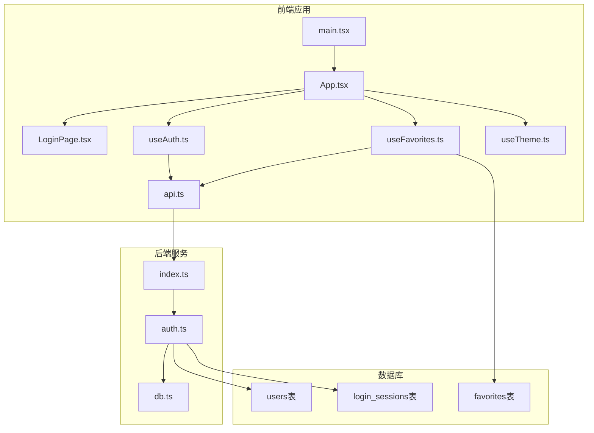

**图表来源**
- [main.tsx:1-14](file://src/main.tsx#L1-L14)
- [App.tsx:1-63](file://src/App.tsx#L1-L63)
- [useAuth.ts:1-89](file://src/hooks/useAuth.ts#L1-L89)
- [auth.ts:1-109](file://server/src/routes/auth.ts#L1-L109)
- [db.ts:1-126](file://server/src/db.ts#L1-L126)

**章节来源**
- [main.tsx:1-14](file://src/main.tsx#L1-L14)
- [App.tsx:1-63](file://src/App.tsx#L1-L63)

## 核心组件

### 用户认证 Hook (useAuth)

`useAuth` 是整个用户状态管理系统的核心，负责处理用户登录、登出、状态持久化等所有认证相关逻辑。

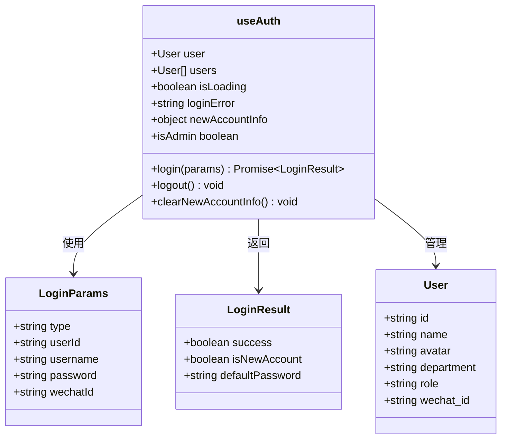

**图表来源**
- [useAuth.ts:6-18](file://src/hooks/useAuth.ts#L6-L18)
- [useAuth.ts:20-88](file://src/hooks/useAuth.ts#L20-L88)
- [index.ts:29-36](file://src/types/index.ts#L29-L36)

### 登录页面组件

登录页面提供了三种登录方式的界面，支持游客访问、账号密码登录和企业微信登录。

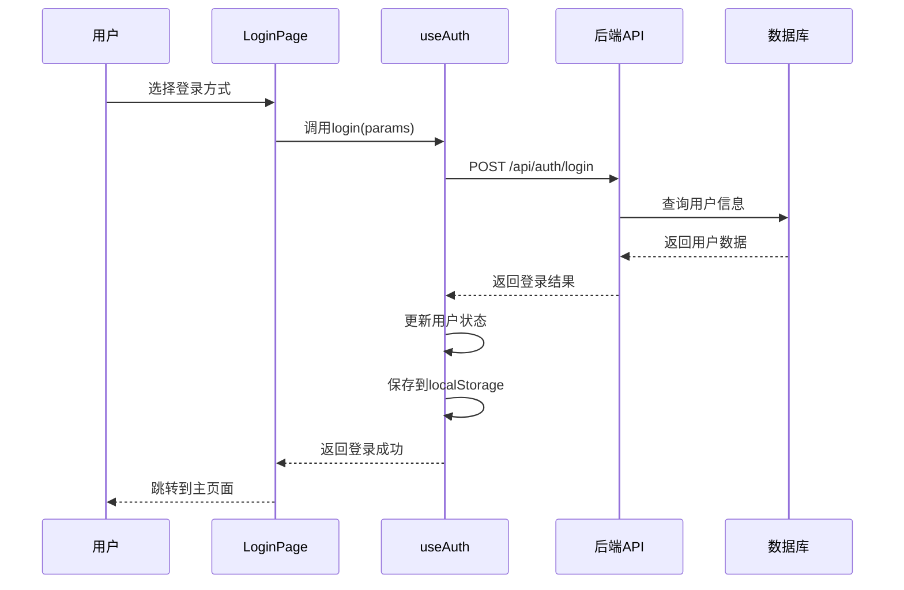

**图表来源**
- [LoginPage.tsx:30-40](file://src/pages/LoginPage.tsx#L30-L40)
- [useAuth.ts:37-72](file://src/hooks/useAuth.ts#L37-L72)
- [auth.ts:36-106](file://server/src/routes/auth.ts#L36-L106)

**章节来源**
- [useAuth.ts:1-89](file://src/hooks/useAuth.ts#L1-L89)
- [LoginPage.tsx:1-250](file://src/pages/LoginPage.tsx#L1-L250)

## 架构概览

系统采用分层架构设计，实现了清晰的关注点分离：

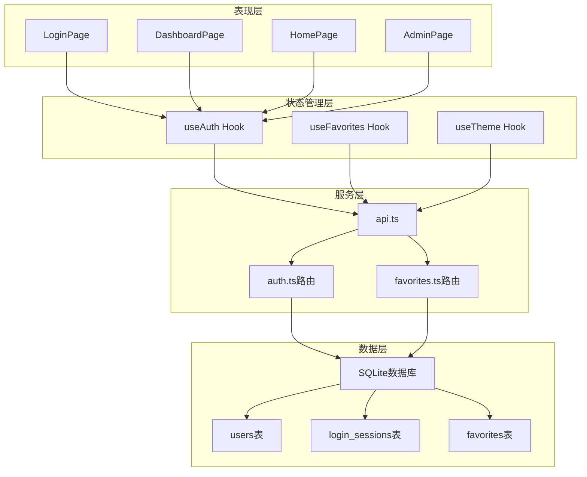

**图表来源**
- [App.tsx:12-60](file://src/App.tsx#L12-L60)
- [useAuth.ts:20-88](file://src/hooks/useAuth.ts#L20-L88)
- [auth.ts:1-109](file://server/src/routes/auth.ts#L1-L109)
- [db.ts:12-75](file://server/src/db.ts#L12-L75)

## 详细组件分析

### 用户状态持久化机制

系统实现了多层次的状态持久化策略：

#### 本地存储策略

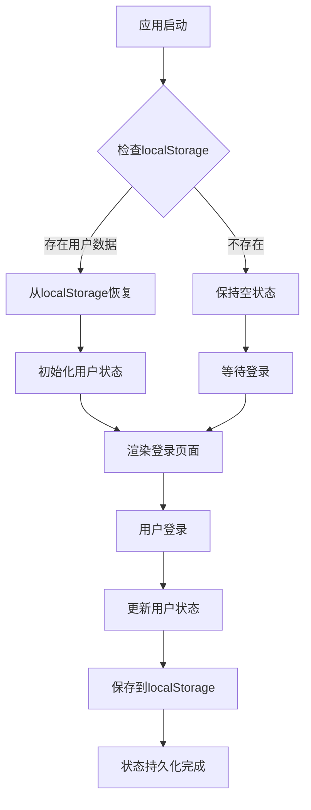

**图表来源**
- [useAuth.ts:21-24](file://src/hooks/useAuth.ts#L21-L24)
- [useAuth.ts:59](file://src/hooks/useAuth.ts#L59)

#### 自动登录流程

系统支持基于本地存储的自动登录机制：

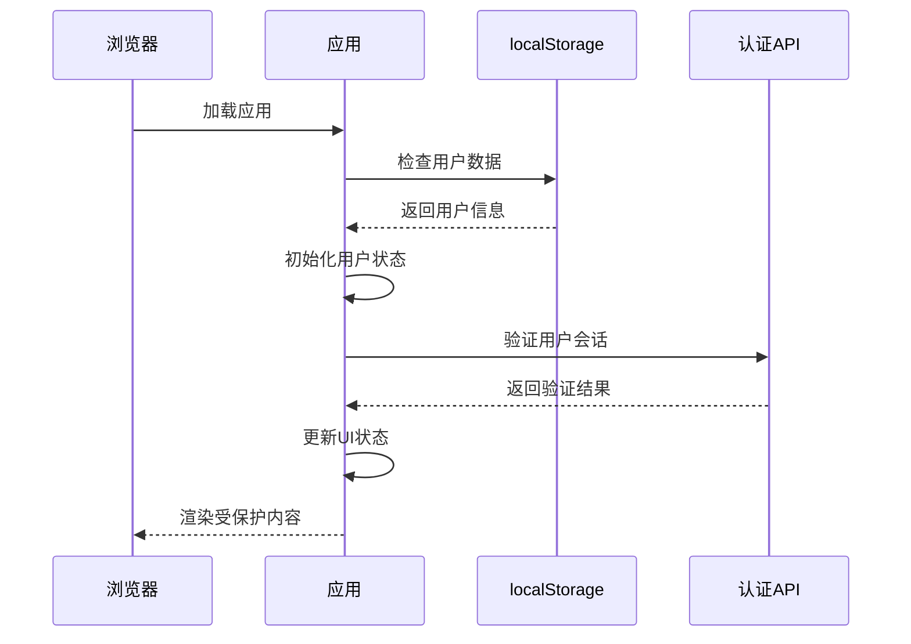

**图表来源**
- [useAuth.ts:21-24](file://src/hooks/useAuth.ts#L21-L24)
- [useAuth.ts:37-72](file://src/hooks/useAuth.ts#L37-L72)

#### 用户信息缓存策略

系统采用了混合缓存策略，结合本地缓存和服务器同步：

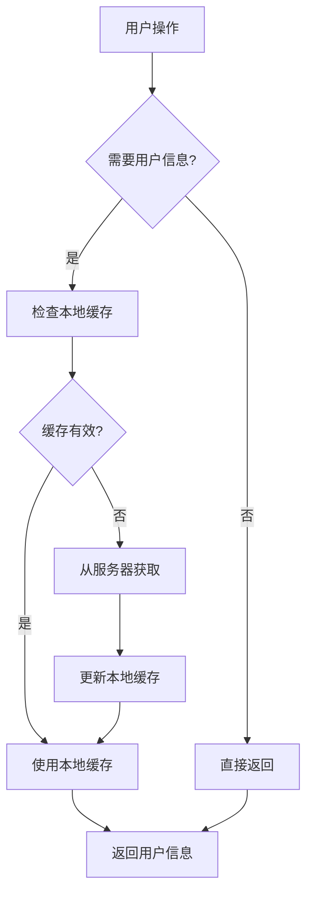

**图表来源**
- [useAuth.ts:30-35](file://src/hooks/useAuth.ts#L30-L35)
- [useFavorites.ts:19-21](file://src/hooks/useFavorites.ts#L19-L21)

### 序列化和反序列化处理

系统在用户状态的序列化和反序列化方面采用了安全的处理方式：

#### 状态序列化流程

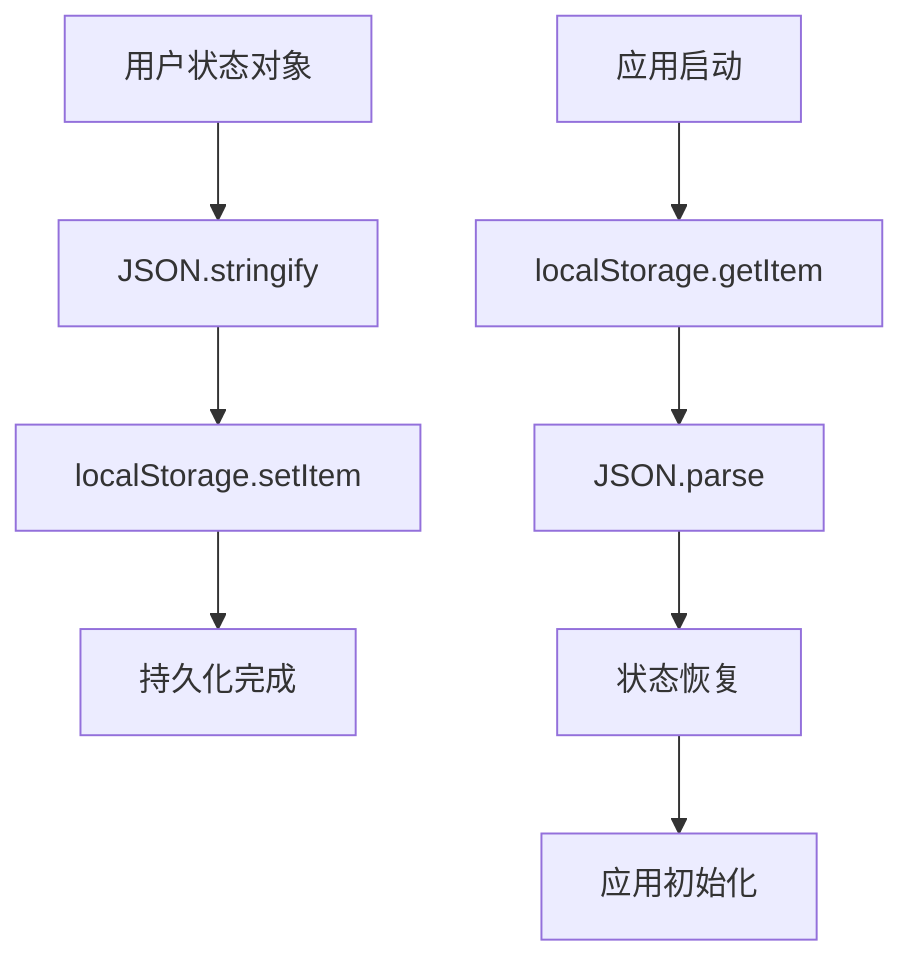

**图表来源**
- [useAuth.ts:22-24](file://src/hooks/useAuth.ts#L22-L24)
- [useAuth.ts:59](file://src/hooks/useAuth.ts#L59)

#### 异常处理机制

系统实现了完善的异常处理机制：

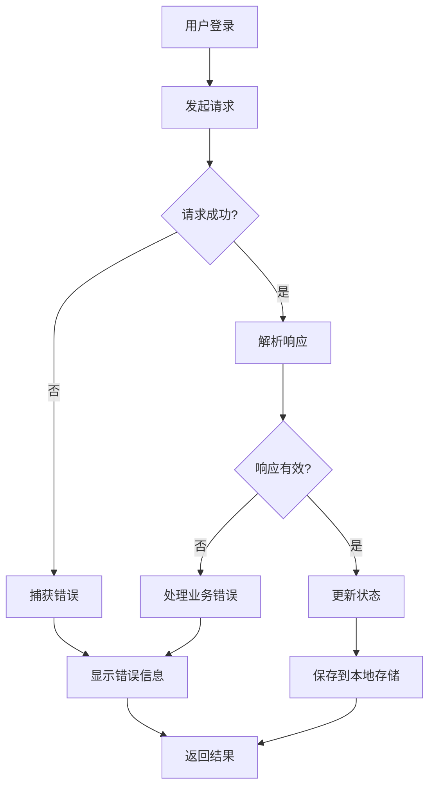

**图表来源**
- [useAuth.ts:48-51](file://src/hooks/useAuth.ts#L48-L51)
- [useAuth.ts:66-71](file://src/hooks/useAuth.ts#L66-L71)

### 登录方式实现

系统支持三种不同的登录方式：

#### 游客访问模式

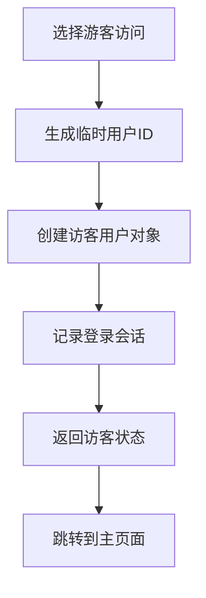

**图表来源**
- [auth.ts:46-51](file://server/src/routes/auth.ts#L46-L51)

#### 企业微信登录

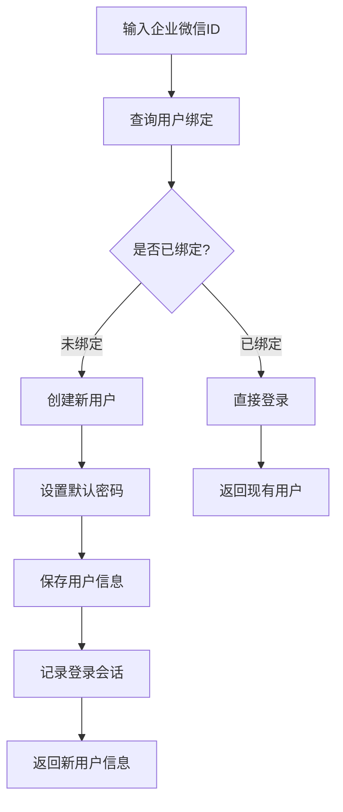

**图表来源**
- [auth.ts:54-82](file://server/src/routes/auth.ts#L54-L82)

#### 账号密码登录

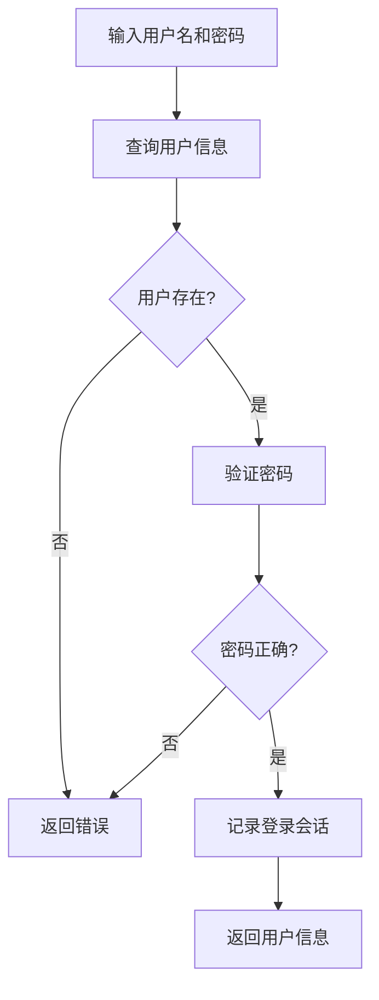

**图表来源**
- [auth.ts:84-95](file://server/src/routes/auth.ts#L84-L95)

### 状态传播机制

系统通过 React 组件树实现了用户状态的有效传播：

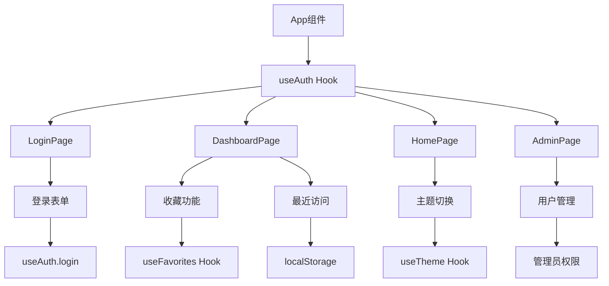

**图表来源**
- [App.tsx:12-60](file://src/App.tsx#L12-L60)
- [useAuth.ts:85](file://src/hooks/useAuth.ts#L85)

**章节来源**
- [useAuth.ts:20-88](file://src/hooks/useAuth.ts#L20-L88)
- [auth.ts:1-109](file://server/src/routes/auth.ts#L1-L109)

## 依赖关系分析

系统各组件之间的依赖关系如下：

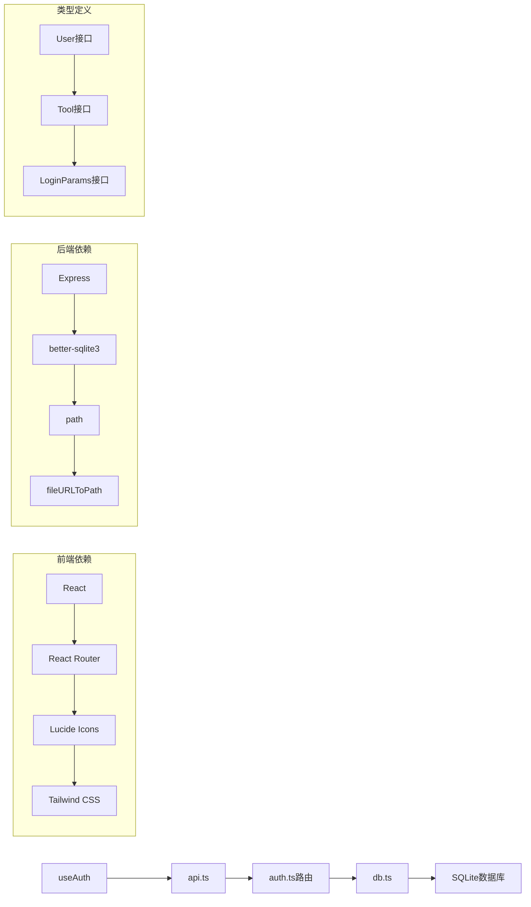

**图表来源**
- [index.ts:1-14](file://src/main.tsx#L1-L14)
- [index.ts:1-50](file://server/src/index.ts#L1-L50)
- [index.ts:1-37](file://src/types/index.ts#L1-L37)

**章节来源**
- [index.ts:1-14](file://src/main.tsx#L1-L14)
- [index.ts:1-50](file://server/src/index.ts#L1-L50)

## 性能考虑

### 状态管理优化

1. **状态提升策略**：将用户状态提升到应用根组件，避免重复获取用户信息
2. **本地存储缓存**：利用 localStorage 减少服务器请求频率
3. **懒加载机制**：按需加载用户相关的功能模块

### 数据同步优化

1. **批量操作**：合并多个状态更新操作
2. **防抖处理**：对频繁的状态变更进行防抖
3. **增量更新**：只更新变化的部分状态

### 缓存策略

1. **多级缓存**：内存缓存 + 本地存储 + 服务器缓存
2. **失效策略**：设置合理的缓存过期时间
3. **一致性保证**：确保缓存与服务器数据的一致性

## 故障排除指南

### 常见问题及解决方案

#### 登录失败问题

**症状**：用户无法登录，出现错误提示

**可能原因**：
1. 网络连接问题
2. 用户名或密码错误
3. 服务器端认证失败

**解决步骤**：
1. 检查网络连接状态
2. 验证用户名和密码格式
3. 查看服务器日志
4. 清除浏览器缓存重新尝试

#### 状态丢失问题

**症状**：用户刷新页面后需要重新登录

**可能原因**：
1. localStorage 存储失败
2. 浏览器隐私设置阻止存储
3. 浏览器缓存清理

**解决步骤**：
1. 检查浏览器存储权限
2. 确认 localStorage 可用性
3. 尝试禁用隐私模式
4. 清理浏览器缓存

#### 权限验证问题

**症状**：管理员功能不可用

**可能原因**：
1. 用户角色信息错误
2. 服务器端权限验证失败
3. 客户端状态不同步

**解决步骤**：
1. 检查用户角色字段
2. 验证服务器端权限配置
3. 刷新页面重新获取权限
4. 检查网络请求响应

### 调试方法

#### 前端调试

1. **浏览器开发者工具**：监控网络请求和响应
2. **React DevTools**：检查组件状态和props
3. **Console日志**：添加关键操作的日志输出
4. **localStorage检查**：验证用户数据存储

#### 后端调试

1. **服务器日志**：查看认证过程的详细日志
2. **数据库查询**：验证用户数据的正确性
3. **API测试**：使用Postman等工具测试接口
4. **会话跟踪**：监控用户登录会话状态

**章节来源**
- [useAuth.ts:66-71](file://src/hooks/useAuth.ts#L66-L71)
- [auth.ts:24-29](file://server/src/routes/auth.ts#L24-L29)

## 结论

本项目实现了完整的用户状态管理系统，具有以下特点：

1. **多登录方式支持**：提供游客访问、账号密码、企业微信三种登录方式
2. **状态持久化**：通过本地存储实现用户状态的持久化
3. **跨页面共享**：通过状态提升和Hook机制实现状态在组件树中的传播
4. **自动登录**：支持基于本地存储的自动登录功能
5. **安全可靠**：实现了完善的错误处理和异常恢复机制

系统架构清晰，代码结构合理，为用户提供了流畅的认证体验。通过合理的缓存策略和性能优化，确保了系统的高效运行。建议在实际部署中根据具体需求调整缓存策略和安全配置，以满足不同场景下的使用要求。