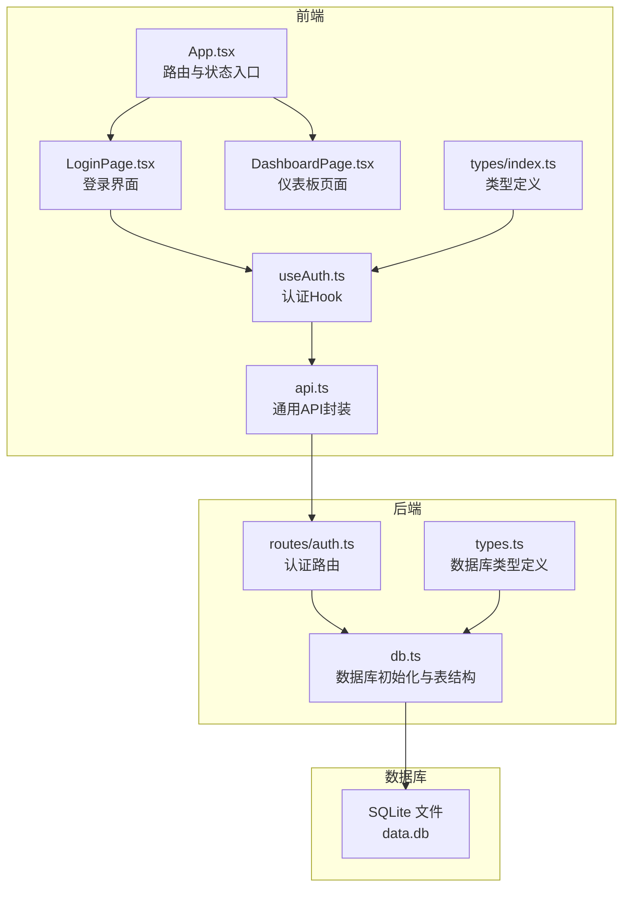
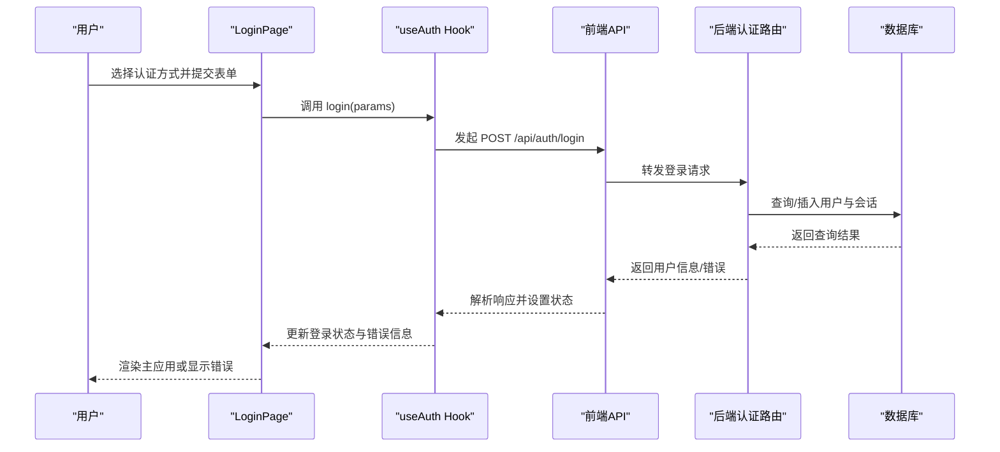
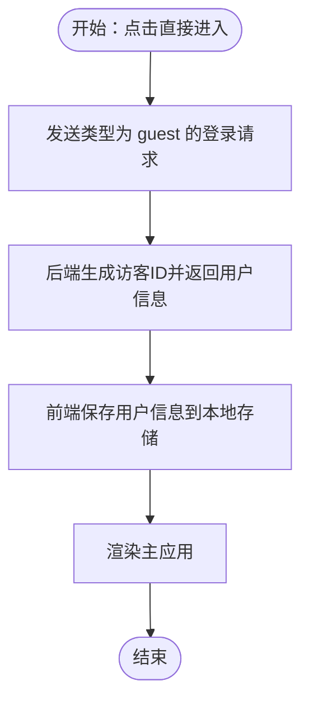
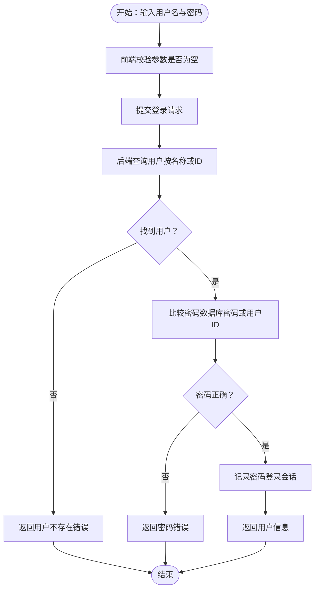
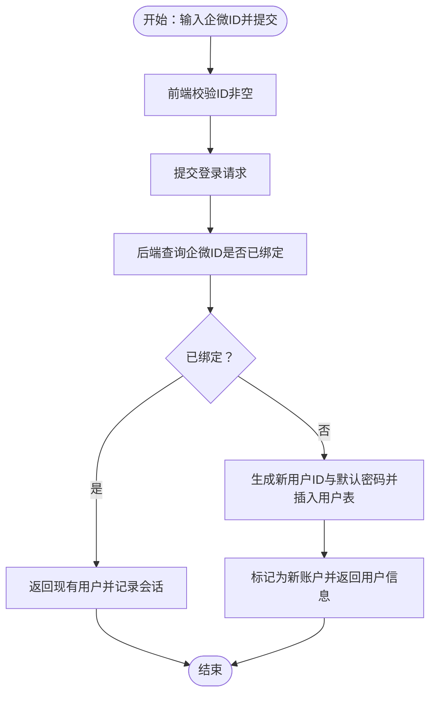
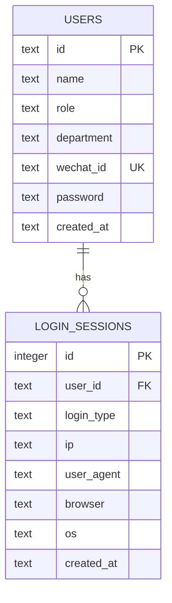
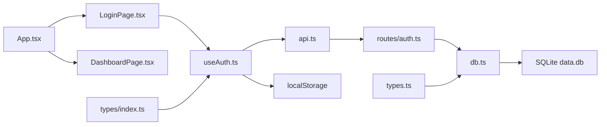

# 认证方式

<cite>
**本文引用的文件**
- [LoginPage.tsx](file://src/pages/LoginPage.tsx)
- [useAuth.ts](file://src/hooks/useAuth.ts)
- [auth.ts](file://server/src/routes/auth.ts)
- [db.ts](file://server/src/db.ts)
- [types.ts](file://server/src/types.ts)
- [api.ts](file://src/lib/api.ts)
- [index.ts](file://src/types/index.ts)
- [App.tsx](file://src/App.tsx)
- [DashboardPage.tsx](file://src/pages/DashboardPage.tsx)
- [部署手册.md](file://部署手册.md)
</cite>

## 目录
1. [简介](#简介)
2. [项目结构](#项目结构)
3. [核心组件](#核心组件)
4. [架构总览](#架构总览)
5. [详细组件分析](#详细组件分析)
6. [依赖关系分析](#依赖关系分析)
7. [性能考虑](#性能考虑)
8. [故障排除指南](#故障排除指南)
9. [结论](#结论)
10. [附录](#附录)

## 简介
本文件系统性阐述本项目的三种认证方式：游客访问、账号密码认证、企业微信认证。文档覆盖各认证方式的工作流程、参数传递、状态管理、界面交互设计、表单验证规则、错误处理与用户体验优化，并提供最佳实践指导与代码示例路径。

## 项目结构
认证相关的核心文件分布于前端与后端：
- 前端负责登录界面、状态管理与API调用
- 后端负责用户数据存储、登录逻辑与会话记录
- 数据库采用SQLite文件型数据库，自动初始化表结构与种子数据

图表来源
- [LoginPage.tsx:1-250](file://src/pages/LoginPage.tsx#L1-L250)
- [useAuth.ts:1-89](file://src/hooks/useAuth.ts#L1-L89)
- [App.tsx:1-63](file://src/App.tsx#L1-L63)
- [DashboardPage.tsx:1-50](file://src/pages/DashboardPage.tsx#L1-L50)
- [api.ts:1-36](file://src/lib/api.ts#L1-L36)
- [auth.ts:1-109](file://server/src/routes/auth.ts#L1-L109)
- [db.ts:1-126](file://server/src/db.ts#L1-L126)
- [types.ts:1-46](file://server/src/types.ts#L1-L46)
- [index.ts:1-37](file://src/types/index.ts#L1-L37)

章节来源
- [LoginPage.tsx:1-250](file://src/pages/LoginPage.tsx#L1-L250)
- [useAuth.ts:1-89](file://src/hooks/useAuth.ts#L1-L89)
- [auth.ts:1-109](file://server/src/routes/auth.ts#L1-L109)
- [db.ts:1-126](file://server/src/db.ts#L1-L126)

## 核心组件
- 登录界面组件：负责三种认证方式的UI展示与表单交互，包括游客访问、账号密码登录、企业微信登录。
- 认证Hook：封装登录请求、状态管理（用户、加载中、错误、新账户信息）、登出与管理员权限判断。
- 认证路由：后端实现三种登录方式的业务逻辑与数据库操作。
- 数据库：SQLite文件型数据库，自动初始化用户表、使用日志表、收藏表、二进制标签表与登录会话表。
- 类型定义：前后端统一的用户类型与数据库类型，保证数据一致性。

章节来源
- [LoginPage.tsx:1-250](file://src/pages/LoginPage.tsx#L1-L250)
- [useAuth.ts:1-89](file://src/hooks/useAuth.ts#L1-L89)
- [auth.ts:1-109](file://server/src/routes/auth.ts#L1-L109)
- [db.ts:1-126](file://server/src/db.ts#L1-L126)
- [index.ts:1-37](file://src/types/index.ts#L1-L37)
- [types.ts:1-46](file://server/src/types.ts#L1-L46)

## 架构总览
认证流程从用户在登录页选择认证方式开始，前端通过useAuth Hook发起登录请求，后端根据类型执行相应逻辑并返回用户信息。登录成功后，前端将用户信息持久化到本地存储，并渲染主应用路由。

图表来源
- [LoginPage.tsx:30-50](file://src/pages/LoginPage.tsx#L30-L50)
- [useAuth.ts:37-72](file://src/hooks/useAuth.ts#L37-L72)
- [auth.ts:36-106](file://server/src/routes/auth.ts#L36-L106)
- [db.ts:12-75](file://server/src/db.ts#L12-L75)

## 详细组件分析

### 游客访问认证
- 工作流程
  - 用户点击“直接进入”按钮触发登录请求，前端发送类型为“guest”的登录参数。
  - 后端生成临时访客ID（带时间戳），返回访客用户对象，同时记录一次访客登录会话。
  - 前端保存用户信息到本地存储，进入主应用。
- 参数传递
  - 前端：type: "guest"
  - 后端：接收并校验类型，生成访客ID与默认名称，写入会话表。
- 状态管理
  - 前端：设置用户状态为访客，清除错误与新账户信息，禁用加载状态。
- 错误处理
  - 后端未登录参数时返回400错误，前端捕获并显示错误信息。
- 用户体验
  - 界面简洁，无输入项，适合快速体验功能。

图表来源
- [LoginPage.tsx:161-175](file://src/pages/LoginPage.tsx#L161-L175)
- [useAuth.ts:37-72](file://src/hooks/useAuth.ts#L37-L72)
- [auth.ts:45-51](file://server/src/routes/auth.ts#L45-L51)

章节来源
- [LoginPage.tsx:161-175](file://src/pages/LoginPage.tsx#L161-L175)
- [useAuth.ts:37-72](file://src/hooks/useAuth.ts#L37-L72)
- [auth.ts:45-51](file://server/src/routes/auth.ts#L45-L51)

### 账号密码认证
- 工作流程
  - 用户在“账号密码”标签页输入用户名与密码，提交表单。
  - 后端根据用户名或ID查询用户，若存在则比较密码（优先使用数据库中的密码字段，否则回退到用户ID作为密码）。
  - 密码正确则返回用户信息并记录一次密码登录会话；否则返回401未授权错误。
- 参数传递
  - 前端：type: "password"，username，password
  - 后端：校验必填参数，查询用户并进行密码验证。
- 表单验证规则
  - 前端：用户名与密码均非空时才允许提交。
- 状态管理
  - 前端：设置加载状态，捕获错误并显示；成功后保存用户信息。
- 错误处理
  - 用户不存在、密码错误、参数缺失等场景均返回相应错误信息。
- 用户体验
  - 输入框禁用加载期间，提交按钮在参数有效时可用，提升交互反馈。

图表来源
- [LoginPage.tsx:177-202](file://src/pages/LoginPage.tsx#L177-L202)
- [useAuth.ts:37-72](file://src/hooks/useAuth.ts#L37-L72)
- [auth.ts:84-95](file://server/src/routes/auth.ts#L84-L95)

章节来源
- [LoginPage.tsx:177-202](file://src/pages/LoginPage.tsx#L177-L202)
- [useAuth.ts:37-72](file://src/hooks/useAuth.ts#L37-L72)
- [auth.ts:84-95](file://server/src/routes/auth.ts#L84-L95)

### 企业微信认证
- 工作流程
  - 用户在“企微登录”标签页输入企微ID，提交表单。
  - 后端先查询该企微ID是否已绑定用户：
    - 若已绑定：直接返回该用户并记录一次企微登录会话。
    - 若未绑定：自动生成普通用户ID与默认密码，插入用户表并返回新用户信息及“新账户”标记。
- 参数传递
  - 前端：type: "wechat"，wechatId
  - 后端：校验必填参数，查询绑定或创建用户。
- 表单验证规则
  - 前端：企微ID非空时才允许提交；支持点击二维码区域聚焦输入框。
- 状态管理
  - 前端：若为新账户，保存默认密码与用户ID，弹出新账户通知卡片，支持复制账号与密码。
- 错误处理
  - 企微ID缺失返回400错误；绑定冲突或数据库异常返回相应错误。
- 用户体验
  - 首次登录自动创建账户并绑定企微，提供复制账号/密码的便捷操作，降低用户记忆成本。

图表来源
- [LoginPage.tsx:204-238](file://src/pages/LoginPage.tsx#L204-L238)
- [useAuth.ts:37-72](file://src/hooks/useAuth.ts#L37-L72)
- [auth.ts:53-82](file://server/src/routes/auth.ts#L53-L82)

章节来源
- [LoginPage.tsx:204-238](file://src/pages/LoginPage.tsx#L204-L238)
- [useAuth.ts:37-72](file://src/hooks/useAuth.ts#L37-L72)
- [auth.ts:53-82](file://server/src/routes/auth.ts#L53-L82)

### 登录界面交互设计与表单验证
- 交互设计
  - 顶部品牌区与右侧登录表单布局，左侧展示产品介绍图。
  - 三个标签页切换：游客访问、账号密码、企微登录。
  - 新账户通知卡片：首次企微登录后显示，包含自动生成的账号与默认密码，支持一键复制。
  - 加载状态：登录过程中禁用按钮并显示加载动画。
  - 错误提示：登录失败时显示错误信息。
- 表单验证
  - 账号密码：用户名与密码均非空。
  - 企微登录：企微ID非空。
  - 游客访问：无需输入。
- 用户体验优化
  - 企微登录支持点击二维码区域聚焦输入框。
  - 新账户通知卡片提供复制按钮与“我已记下，进入系统”按钮。
  - 登录按钮在参数有效时可用，加载期间禁用，避免重复提交。

章节来源
- [LoginPage.tsx:52-133](file://src/pages/LoginPage.tsx#L52-L133)
- [LoginPage.tsx:177-238](file://src/pages/LoginPage.tsx#L177-L238)

### 状态管理与持久化
- useAuth Hook
  - 维护用户状态、加载状态、错误信息、新账户信息。
  - 登录成功后将用户信息保存到本地存储，仪表板页面读取最近使用记录。
  - 提供登出清理本地存储与新账户信息的能力。
- App 路由
  - 当用户不存在或存在新账户信息时渲染登录页；否则渲染主应用路由。
- Dashboard 页面
  - 读取用户信息并渲染工具网格与收藏/最近记录。

章节来源
- [useAuth.ts:20-89](file://src/hooks/useAuth.ts#L20-L89)
- [App.tsx:17-19](file://src/App.tsx#L17-L19)
- [DashboardPage.tsx:16-49](file://src/pages/DashboardPage.tsx#L16-L49)

### 数据模型与会话记录
- 用户表
  - 字段：id、name、role、department、wechat_id（唯一）、password、created_at。
  - 角色：user、admin。
- 登录会话表
  - 字段：id、user_id、login_type（wechat/password/guest）、ip、user_agent、browser、os、created_at。
  - 用于审计与统计登录来源。
- 数据库初始化
  - 首次启动自动创建表结构与种子数据（默认管理员与普通用户）。

图表来源
- [db.ts:14-75](file://server/src/db.ts#L14-L75)
- [types.ts:1-46](file://server/src/types.ts#L1-L46)

章节来源
- [db.ts:14-75](file://server/src/db.ts#L14-L75)
- [types.ts:1-46](file://server/src/types.ts#L1-L46)

## 依赖关系分析
- 前端依赖
  - LoginPage 依赖 useAuth Hook 与 UI 组件库。
  - useAuth 依赖 api.ts 封装的登录接口与本地存储。
  - App 路由依赖 useAuth Hook 控制登录状态与渲染。
- 后端依赖
  - 认证路由依赖数据库模块与类型定义。
  - 数据库模块负责表结构初始化与种子数据填充。
- 前后端通信
  - 前端通过 /api/auth/login 发送登录请求，后端返回用户信息或错误。
  - 前端通过 /api/auth/users 获取用户列表（用于管理后台）。

图表来源
- [LoginPage.tsx:1-250](file://src/pages/LoginPage.tsx#L1-L250)
- [useAuth.ts:1-89](file://src/hooks/useAuth.ts#L1-L89)
- [api.ts:1-36](file://src/lib/api.ts#L1-L36)
- [auth.ts:1-109](file://server/src/routes/auth.ts#L1-L109)
- [db.ts:1-126](file://server/src/db.ts#L1-L126)
- [types.ts:1-46](file://server/src/types.ts#L1-L46)
- [index.ts:1-37](file://src/types/index.ts#L1-L37)
- [App.tsx:1-63](file://src/App.tsx#L1-L63)
- [DashboardPage.tsx:1-50](file://src/pages/DashboardPage.tsx#L1-L50)

章节来源
- [LoginPage.tsx:1-250](file://src/pages/LoginPage.tsx#L1-L250)
- [useAuth.ts:1-89](file://src/hooks/useAuth.ts#L1-L89)
- [api.ts:1-36](file://src/lib/api.ts#L1-L36)
- [auth.ts:1-109](file://server/src/routes/auth.ts#L1-L109)
- [db.ts:1-126](file://server/src/db.ts#L1-L126)
- [types.ts:1-46](file://server/src/types.ts#L1-L46)
- [index.ts:1-37](file://src/types/index.ts#L1-L37)
- [App.tsx:1-63](file://src/App.tsx#L1-L63)
- [DashboardPage.tsx:1-50](file://src/pages/DashboardPage.tsx#L1-L50)

## 性能考虑
- 前端
  - 使用本地存储缓存用户信息，减少重复登录。
  - 登录过程禁用按钮与输入框，避免重复请求。
  - 仪表板页面按需读取收藏与最近记录，避免全量加载。
- 后端
  - SQLite 适用于中小规模数据，注意数据库文件备份与IO性能。
  - 登录会话表建立索引，便于审计与分页查询。
- 部署
  - 前端静态资源由Nginx提供，后端通过反向代理转发 /api/*。
  - PM2 管理后端进程，支持日志与自动重启。

[本节为通用性能讨论，不直接分析具体文件]

## 故障排除指南
- 前端常见问题
  - “无法连接到 API”：确认前端API基础路径为相对路径，Nginx反向代理配置正确。
  - 登录后仍显示登录页：检查本地存储是否成功写入用户信息。
  - 404页面刷新：确认Nginx配置中 try_files 指令正确。
- 后端常见问题
  - CORS 跨域报错：设置环境变量 CORS_ORIGIN 为具体域名。
  - 数据库文件丢失：升级前务必备份 data.db。
  - PM2 启动失败：查看日志定位端口占用等问题。
- 认证相关问题
  - 企微ID重复绑定：后端已做唯一约束，避免重复绑定。
  - 密码错误：确认密码字段或回退到用户ID作为密码的规则。

章节来源
- [部署手册.md:411-439](file://部署手册.md#L411-L439)
- [auth.ts:58-64](file://server/src/routes/auth.ts#L58-L64)
- [db.ts:19](file://server/src/db.ts#L19)

## 结论
本项目提供了三种实用的认证方式：游客访问满足快速体验需求，账号密码认证适用于传统用户体系，企业微信认证结合自动创建与绑定机制，简化了企业用户的接入流程。前端通过清晰的界面与状态管理，后端通过完善的数据库与会话记录，共同保障了认证流程的稳定性与可审计性。建议在生产环境中强化密码策略、完善会话超时与安全日志，并持续优化用户体验。

[本节为总结性内容，不直接分析具体文件]

## 附录
- 最佳实践
  - 强密码策略：建议在账号密码认证中引入密码强度校验与定期更换机制。
  - 会话安全：增加会话超时与多设备登录控制，必要时引入令牌刷新。
  - 企业微信：建议在后端增加企微ID与用户信息的同步机制，避免信息不同步。
  - 错误处理：统一错误码与提示文案，增强用户可读性。
  - 性能监控：在登录会话表基础上扩展登录失败统计与异常告警。

[本节为通用建议，不直接分析具体文件]