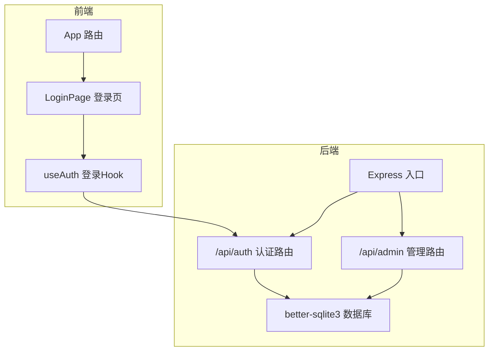
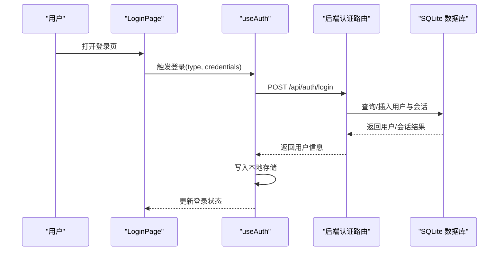
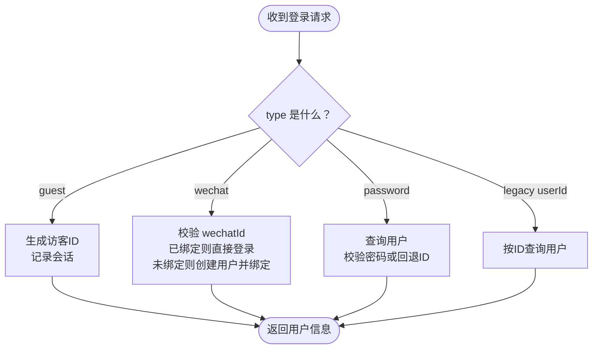
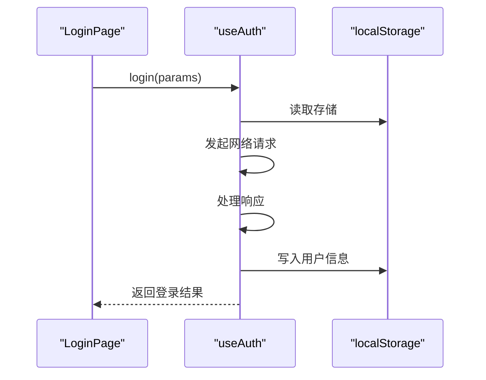
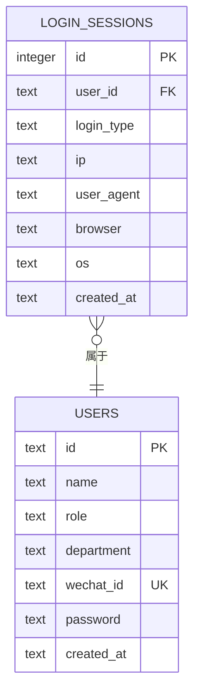
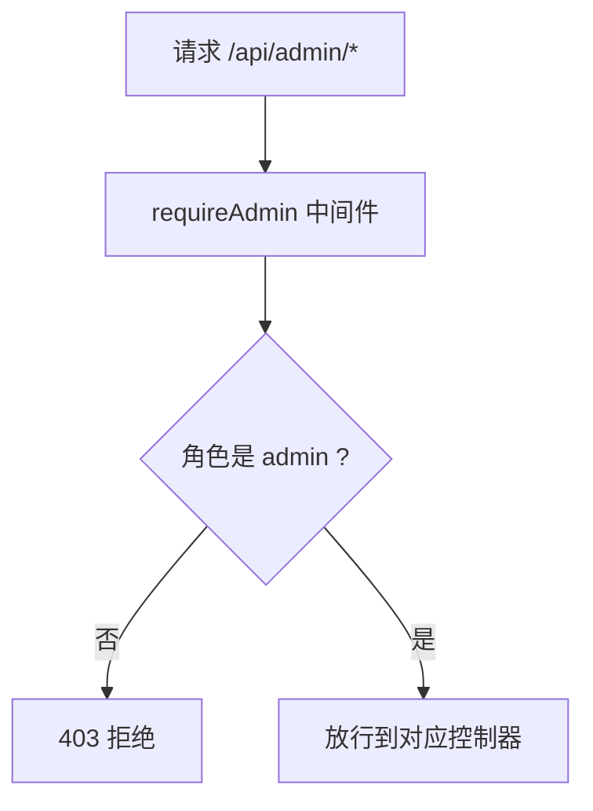
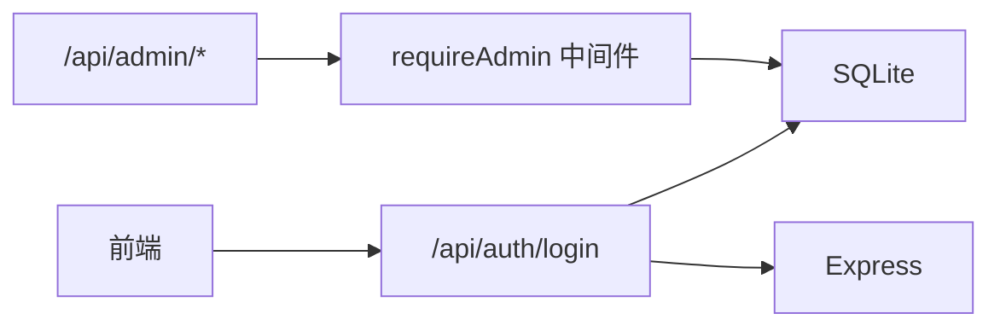

# 认证系统

<cite>
**本文引用的文件**
- [server/src/routes/auth.ts](file://server/src/routes/auth.ts)
- [server/src/db.ts](file://server/src/db.ts)
- [server/src/types.ts](file://server/src/types.ts)
- [server/src/index.ts](file://server/src/index.ts)
- [server/src/routes/admin.ts](file://server/src/routes/admin.ts)
- [src/hooks/useAuth.ts](file://src/hooks/useAuth.ts)
- [src/pages/LoginPage.tsx](file://src/pages/LoginPage.tsx)
- [src/App.tsx](file://src/App.tsx)
- [src/types/index.ts](file://src/types/index.ts)
- [server/package.json](file://server/package.json)
- [package.json](file://package.json)
</cite>

## 目录
1. [简介](#简介)
2. [项目结构](#项目结构)
3. [核心组件](#核心组件)
4. [架构总览](#架构总览)
5. [详细组件分析](#详细组件分析)
6. [依赖关系分析](#依赖关系分析)
7. [性能考量](#性能考量)
8. [故障排查指南](#故障排查指南)
9. [结论](#结论)
10. [附录](#附录)

## 简介
本认证系统为一个前后端分离的应用提供统一的用户认证与权限控制能力，支持三种登录方式：访客登录、账号密码登录、企业微信（WeChat）登录。系统通过本地数据库存储用户信息与登录会话，并在前端进行登录状态持久化与自动登录。管理员具备用户管理与审计日志查看等高级权限。

## 项目结构
- 前端位于 src 目录，包含页面组件、React Hooks、类型定义与路由入口。
- 后端位于 server 目录，采用 Express 提供 REST 接口，使用 better-sqlite3 存储数据。
- 认证相关的关键模块：
  - 前端登录 Hook：负责调用后端接口、维护登录状态与本地存储。
  - 后端认证路由：处理不同登录方式、记录会话信息。
  - 数据库初始化与表结构：用户表、登录会话表等。
  - 管理员中间件与接口：校验管理员角色并提供用户与会话审计。

图表来源
- [server/src/index.ts:1-31](file://server/src/index.ts#L1-L31)
- [server/src/routes/auth.ts:1-109](file://server/src/routes/auth.ts#L1-L109)
- [server/src/routes/admin.ts:1-93](file://server/src/routes/admin.ts#L1-L93)
- [server/src/db.ts:1-126](file://server/src/db.ts#L1-L126)

章节来源
- [server/src/index.ts:1-31](file://server/src/index.ts#L1-L31)
- [server/src/db.ts:12-75](file://server/src/db.ts#L12-L75)

## 核心组件
- 认证路由（后端）
  - 支持访客登录、企业微信登录、账号密码登录；兼容旧版仅传 userId 的场景。
  - 登录成功后记录会话（IP、UA、浏览器、操作系统）。
- 登录 Hook（前端）
  - 维护用户状态、登录错误、新账号提示；登录成功写入本地存储。
- 数据库模型
  - 用户表含角色字段（user/admin），登录会话表记录登录来源与设备信息。
- 管理员中间件
  - 通过请求头中的用户标识校验管理员角色，保护管理接口。

章节来源
- [server/src/routes/auth.ts:36-106](file://server/src/routes/auth.ts#L36-L106)
- [src/hooks/useAuth.ts:20-89](file://src/hooks/useAuth.ts#L20-L89)
- [server/src/db.ts:14-75](file://server/src/db.ts#L14-L75)
- [server/src/routes/admin.ts:7-14](file://server/src/routes/admin.ts#L7-L14)

## 架构总览
认证系统采用“前端单页应用 + 后端无状态 API”的模式。前端通过 useAuth Hook 发起登录请求，后端根据登录类型执行相应逻辑并返回用户信息。登录状态通过本地存储持久化，刷新页面后自动恢复登录态。管理员通过独立的中间件与接口进行用户与会话审计。

图表来源
- [src/pages/LoginPage.tsx:22-238](file://src/pages/LoginPage.tsx#L22-L238)
- [src/hooks/useAuth.ts:37-72](file://src/hooks/useAuth.ts#L37-L72)
- [server/src/routes/auth.ts:36-106](file://server/src/routes/auth.ts#L36-L106)
- [server/src/db.ts:62-75](file://server/src/db.ts#L62-L75)

## 详细组件分析

### 认证路由（后端）
- 访客登录
  - 生成临时访客 ID，返回访客用户信息并记录会话。
- 企业微信登录
  - 若 wechatId 已绑定用户，则直接登录；否则自动创建普通用户并绑定 wechatId，同时记录会话。
- 账号密码登录
  - 支持按用户名或用户 ID 查询；若用户存在且密码匹配（优先使用数据库密码，否则回退到用户 ID），则记录会话并返回用户信息。
- 旧版兼容
  - 当仅提供 userId 时，按用户 ID 查询并记录会话。

图表来源
- [server/src/routes/auth.ts:36-106](file://server/src/routes/auth.ts#L36-L106)

章节来源
- [server/src/routes/auth.ts:36-106](file://server/src/routes/auth.ts#L36-L106)

### 登录 Hook（前端）
- 初始化
  - 从本地存储读取用户信息，恢复登录态。
- 登录流程
  - 发送登录请求，处理响应（兼容旧格式与新格式）；成功后写入本地存储；若为新账号，暴露默认密码以便提示。
- 登出流程
  - 清空用户信息与相关本地存储项。
- 权限判断
  - 通过角色字段判断是否为管理员。

图表来源
- [src/hooks/useAuth.ts:20-89](file://src/hooks/useAuth.ts#L20-L89)
- [src/pages/LoginPage.tsx:22-238](file://src/pages/LoginPage.tsx#L22-L238)

章节来源
- [src/hooks/useAuth.ts:20-89](file://src/hooks/useAuth.ts#L20-L89)
- [src/types/index.ts:29-36](file://src/types/index.ts#L29-L36)

### 数据库模型与会话记录
- 用户表
  - 字段：id、name、role、department、wechat_id、password、created_at。
  - 约束：role 限定为 user/admin；wechat_id 唯一；外键约束用于扩展表。
- 登录会话表
  - 字段：id、user_id、login_type、ip、user_agent、browser、os、created_at。
  - 索引：按用户与时间建立索引，便于审计与分页查询。
- 管理员接口
  - 通过请求头 x-user-id 获取当前用户并校验角色。

图表来源
- [server/src/db.ts:14-75](file://server/src/db.ts#L14-L75)
- [server/src/types.ts:1-46](file://server/src/types.ts#L1-L46)

章节来源
- [server/src/db.ts:14-75](file://server/src/db.ts#L14-L75)
- [server/src/types.ts:1-46](file://server/src/types.ts#L1-L46)

### 管理员中间件与接口
- 中间件 requireAdmin
  - 从请求头 x-user-id 查询用户角色，非管理员直接拒绝。
- 用户管理接口
  - 列表、创建、更新、删除用户。
- 会话与使用日志审计
  - 分页列出登录会话与使用日志，支持关键词过滤。

图表来源
- [server/src/routes/admin.ts:7-14](file://server/src/routes/admin.ts#L7-L14)

章节来源
- [server/src/routes/admin.ts:7-14](file://server/src/routes/admin.ts#L7-L14)
- [server/src/routes/admin.ts:18-49](file://server/src/routes/admin.ts#L18-L49)
- [server/src/routes/admin.ts:51-90](file://server/src/routes/admin.ts#L51-L90)

## 依赖关系分析
- 前端依赖
  - React、react-router-dom、lucide-react 等；登录页与 Hook 依赖后端 API。
- 后端依赖
  - Express、CORS、better-sqlite3；路由挂载于入口文件。
- 关键耦合点
  - 前端 useAuth 与后端 /api/auth/login 协议一致。
  - 管理员中间件依赖请求头 x-user-id，需确保网关或代理正确透传。

图表来源
- [src/hooks/useAuth.ts:42-46](file://src/hooks/useAuth.ts#L42-L46)
- [server/src/index.ts:17-22](file://server/src/index.ts#L17-L22)
- [server/src/routes/admin.ts:7-14](file://server/src/routes/admin.ts#L7-L14)

章节来源
- [package.json:11-22](file://package.json#L11-L22)
- [server/package.json:10-14](file://server/package.json#L10-L14)
- [server/src/index.ts:17-22](file://server/src/index.ts#L17-L22)

## 性能考量
- 数据库事务与索引
  - 使用 WAL 模式与外键开启提升并发与一致性；为登录会话与日志建立索引，优化分页与审计查询。
- 接口负载
  - 合理限制分页大小（最大 100），避免一次性返回过多数据。
- 前端渲染
  - 登录态读取与写入本地存储，减少重复网络请求；登录页按需渲染各登录方式。

章节来源
- [server/src/db.ts:9-10](file://server/src/db.ts#L9-L10)
- [server/src/db.ts:24-25](file://server/src/db.ts#L24-L25)
- [server/src/db.ts:37-40](file://server/src/db.ts#L37-L40)
- [server/src/db.ts:59-61](file://server/src/db.ts#L59-L61)
- [server/src/routes/admin.ts:56-57](file://server/src/routes/admin.ts#L56-L57)

## 故障排查指南
- 登录失败
  - 检查请求体参数是否完整（type、username/password 或 wechatId）。
  - 查看后端返回的错误信息（如缺少 wechatId、用户名不存在、密码错误）。
- 无法识别管理员
  - 确认请求头 x-user-id 是否正确传递，且对应用户角色为 admin。
- 会话与日志为空
  - 确认数据库中是否存在登录会话与使用日志数据；检查索引与分页参数。
- 前端无法保持登录态
  - 检查本地存储中是否存在 toolbox-user；确认登录成功后写入逻辑是否执行。

章节来源
- [server/src/routes/auth.ts:54-55](file://server/src/routes/auth.ts#L54-L55)
- [server/src/routes/auth.ts:86-95](file://server/src/routes/auth.ts#L86-L95)
- [server/src/routes/admin.ts:9-12](file://server/src/routes/admin.ts#L9-L12)
- [src/hooks/useAuth.ts:21-24](file://src/hooks/useAuth.ts#L21-L24)
- [src/hooks/useAuth.ts:58-63](file://src/hooks/useAuth.ts#L58-L63)

## 结论
该认证系统通过简洁的登录方式与本地存储实现了良好的用户体验，配合数据库会话记录与管理员审计接口，满足了基本的权限管理与安全审计需求。建议在生产环境中进一步引入令牌机制（如 JWT）与 HTTPS 强制传输，以增强安全性与合规性。

## 附录

### 认证流程安全考虑
- 密码策略
  - 当前实现允许使用用户 ID 作为密码回退，建议在生产环境强制使用哈希密码并启用强密码规则。
- 传输安全
  - 建议启用 HTTPS 并在客户端与服务器之间强制 TLS；避免在明文传输敏感信息。
- 令牌与会话
  - 当前未实现基于令牌的会话管理，建议引入短期访问令牌与刷新令牌机制，并在服务端维护令牌黑名单与过期策略。
- 输入校验
  - 对 wechatId、用户名、密码等输入进行长度与格式校验，防止注入与异常行为。

章节来源
- [server/src/routes/auth.ts:86-95](file://server/src/routes/auth.ts#L86-L95)
- [server/src/db.ts:17-18](file://server/src/db.ts#L17-L18)

### 权限管理与角色差异
- 角色定义
  - 用户：普通功能使用。
  - 管理员：具备用户管理与审计接口权限。
- 中间件保护
  - 管理接口通过 requireAdmin 中间件校验角色，非管理员访问将被拒绝。

章节来源
- [server/src/db.ts:17-18](file://server/src/db.ts#L17-L18)
- [server/src/routes/admin.ts:7-14](file://server/src/routes/admin.ts#L7-L14)

### 登录状态持久化与自动登录
- 自动登录
  - 页面加载时从本地存储读取用户信息，恢复登录态。
- 登出清理
  - 清除用户信息与相关本地存储项，确保敏感数据不残留。

章节来源
- [src/hooks/useAuth.ts:21-24](file://src/hooks/useAuth.ts#L21-L24)
- [src/hooks/useAuth.ts:74-79](file://src/hooks/useAuth.ts#L74-L79)

### 认证中间件设计
- 设计要点
  - 通过请求头 x-user-id 获取当前用户上下文，集中校验角色。
  - 将权限校验逻辑与业务接口解耦，提高可维护性。
- 实现位置
  - 管理员中间件位于 /api/admin 路由组内，统一保护管理接口。

章节来源
- [server/src/routes/admin.ts:7-14](file://server/src/routes/admin.ts#L7-L14)