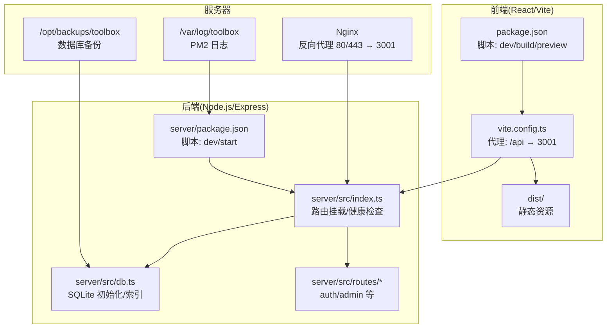
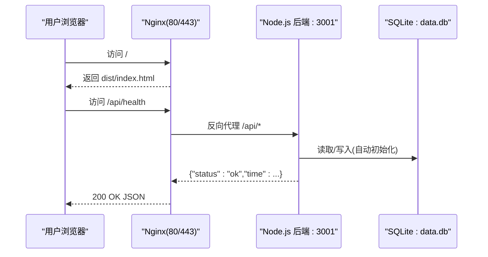
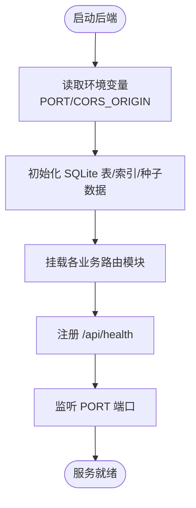
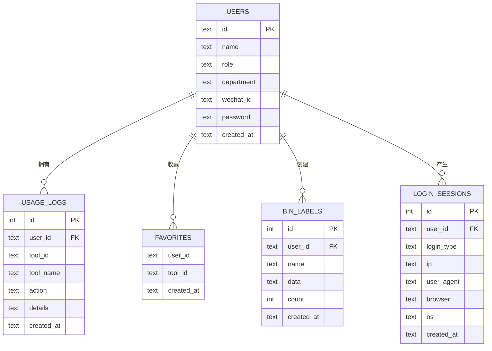
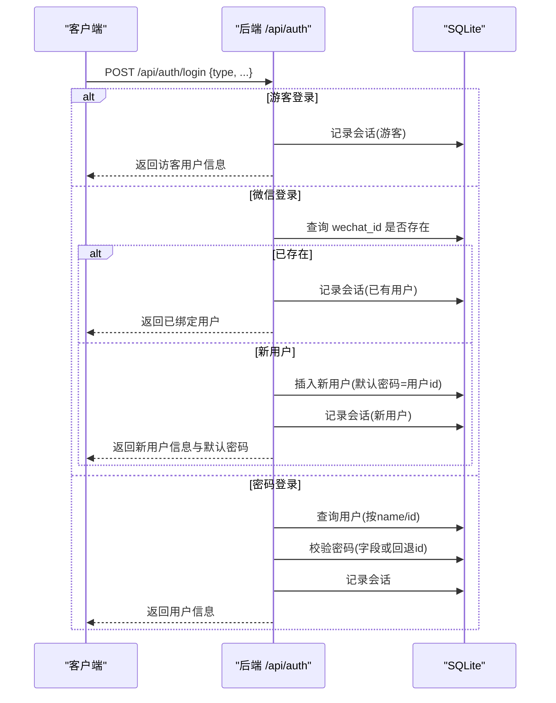
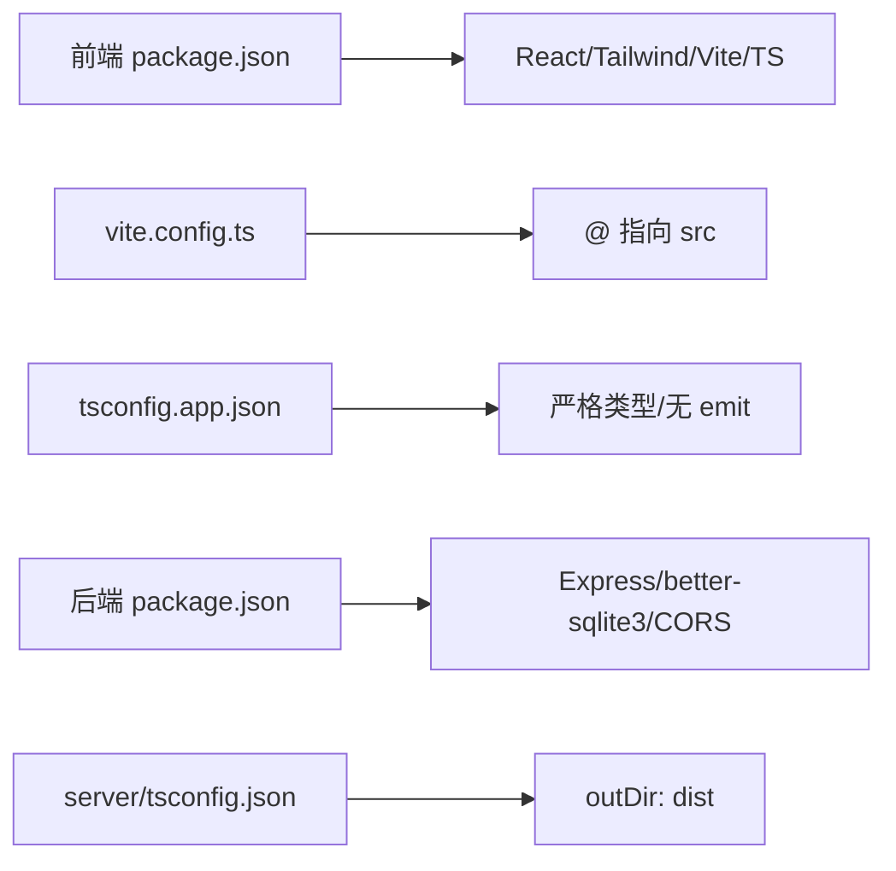

# 部署指南

<cite>
**本文引用的文件**
- [package.json](file://package.json)
- [server/package.json](file://server/package.json)
- [vite.config.ts](file://vite.config.ts)
- [server/src/index.ts](file://server/src/index.ts)
- [server/src/db.ts](file://server/src/db.ts)
- [server/src/routes/auth.ts](file://server/src/routes/auth.ts)
- [server/src/routes/admin.ts](file://server/src/routes/admin.ts)
- [server/src/types.ts](file://server/src/types.ts)
- [tsconfig.json](file://tsconfig.json)
- [tsconfig.app.json](file://tsconfig.app.json)
- [tailwind.config.ts](file://tailwind.config.ts)
- [postcss.config.js](file://postcss.config.js)
- [index.html](file://index.html)
- [部署手册.md](file://部署手册.md)
</cite>

## 目录
1. [简介](#简介)
2. [项目结构](#项目结构)
3. [核心组件](#核心组件)
4. [架构总览](#架构总览)
5. [详细组件分析](#详细组件分析)
6. [依赖关系分析](#依赖关系分析)
7. [性能考虑](#性能考虑)
8. [故障排查指南](#故障排查指南)
9. [结论](#结论)
10. [附录](#附录)

## 简介
本指南面向运维工程师，提供从开发环境到生产环境的完整部署流程，涵盖服务器环境要求、环境变量配置、构建流程、Nginx 反向代理、进程守护与日志、数据库备份策略、SSL 与 HTTPS、以及部署后的验证与常见问题排查。项目采用前后端分离架构：前端基于 React + Vite + TypeScript + Tailwind CSS，后端基于 Express + TypeScript + better-sqlite3，数据库为 SQLite 文件。

## 项目结构
- 前端工程位于仓库根目录，使用 Vite 构建，产物输出至 dist/，由 Nginx 提供静态文件服务。
- 后端工程位于 server/ 目录，使用 Express 提供 REST API，监听端口可通过环境变量配置，默认 3001。
- 数据库为 SQLite 文件，首次运行时自动初始化表结构与种子数据，位于 server/data.db。

图表来源
- [vite.config.ts:1-21](file://vite.config.ts#L1-L21)
- [server/src/index.ts:1-31](file://server/src/index.ts#L1-L31)
- [server/src/db.ts:1-126](file://server/src/db.ts#L1-L126)
- [部署手册.md:117-167](file://部署手册.md#L117-L167)

章节来源
- [部署手册.md:1-467](file://部署手册.md#L1-L467)
- [package.json:1-34](file://package.json#L1-L34)
- [server/package.json:1-23](file://server/package.json#L1-L23)

## 核心组件
- 前端构建与代理
  - 使用 Vite 构建，开发时通过本地代理将 /api 请求转发至后端 3001 端口。
  - 生产环境由 Nginx 提供 dist/ 下的静态资源，并将 /api/* 反向代理到后端。
- 后端服务
  - Express 应用，注册多条业务路由，统一开启 CORS 并限制请求体大小。
  - 提供 /api/health 健康检查端点，便于部署后验证。
- 数据库
  - better-sqlite3 连接 server/data.db，自动创建表与索引，首次启动插入默认用户与示例日志。
- 类型定义
  - 统一导出数据库用户、日志、登录会话等接口类型，保证前后端契约一致。

章节来源
- [vite.config.ts:1-21](file://vite.config.ts#L1-L21)
- [server/src/index.ts:1-31](file://server/src/index.ts#L1-L31)
- [server/src/db.ts:1-126](file://server/src/db.ts#L1-L126)
- [server/src/types.ts:1-46](file://server/src/types.ts#L1-L46)

## 架构总览
系统采用 Nginx + Node.js + SQLite 的单服务器部署模型：
- Nginx 监听 80/443，静态资源直接由 dist/ 提供，/api/* 反向代理到后端 3001。
- 后端通过 better-sqlite3 访问 server/data.db，提供认证、日志、收藏、二进制标签、管理员等接口。
- PM2 管理后端进程，支持开机自启、日志轮转与内存监控。

图表来源
- [部署手册.md:117-167](file://部署手册.md#L117-L167)
- [server/src/index.ts:24-26](file://server/src/index.ts#L24-L26)
- [server/src/db.ts:77-123](file://server/src/db.ts#L77-L123)

## 详细组件分析

### 前端构建与代理
- 构建命令
  - 前端通过脚本进行类型检查与打包，最终产物输出到 dist/。
- 本地开发代理
  - 将 /api 前缀代理到 http://localhost:3001，便于联调后端。
- 生产部署
  - Nginx 将 / 映射到 dist/，并把 /api/* 代理到 127.0.0.1:3001，同时设置必要的头部透传与超时参数。

章节来源
- [package.json:6-10](file://package.json#L6-L10)
- [vite.config.ts:12-20](file://vite.config.ts#L12-L20)
- [部署手册.md:117-167](file://部署手册.md#L117-L167)

### 后端服务与路由
- 启动与端口
  - 通过环境变量 PORT 控制监听端口，默认 3001；CORS 来源由 CORS_ORIGIN 控制，默认允许所有。
- 路由组织
  - 注册 /api/auth、/api/logs、/api/network、/api/favorites、/api/bin-labels、/api/admin 等模块路由。
- 健康检查
  - 提供 GET /api/health 返回服务状态与当前时间，用于部署后快速验证。

图表来源
- [server/src/index.ts:10-31](file://server/src/index.ts#L10-L31)
- [server/src/db.ts:77-123](file://server/src/db.ts#L77-L123)

章节来源
- [server/src/index.ts:1-31](file://server/src/index.ts#L1-L31)
- [server/src/routes/auth.ts:1-109](file://server/src/routes/auth.ts#L1-L109)
- [server/src/routes/admin.ts:1-93](file://server/src/routes/admin.ts#L1-L93)

### 数据库设计与初始化
- 存储位置
  - 数据库文件位于 server/data.db，首次启动自动创建用户、使用日志、收藏、二进制标签、登录会话等表及必要索引。
- 种子数据
  - 若用户表为空，插入默认用户与若干示例日志，便于演示与测试。
- 索引优化
  - 对用户微信标识、日志用户/工具/时间、二进制标签用户/时间、会话用户/时间建立索引，提升查询性能。

图表来源
- [server/src/db.ts:12-75](file://server/src/db.ts#L12-L75)

章节来源
- [server/src/db.ts:1-126](file://server/src/db.ts#L1-L126)

### 管理员权限与安全
- 管理员中间件
  - 通过请求头 x-user-id 获取当前用户并校验角色是否为 admin，非管理员访问受阻。
- 用户管理
  - 支持查询、创建、更新、删除用户，创建时可指定角色与部门，密码缺省回退为用户 id。
- 登录会话与使用日志
  - 管理员可分页查询登录会话与全量使用日志，支持关键词过滤与分页控制。

章节来源
- [server/src/routes/admin.ts:7-14](file://server/src/routes/admin.ts#L7-L14)
- [server/src/routes/admin.ts:18-49](file://server/src/routes/admin.ts#L18-L49)
- [server/src/routes/admin.ts:51-90](file://server/src/routes/admin.ts#L51-L90)

### 认证流程
- 支持三种登录方式
  - 游客登录：生成临时访客身份并记录会话。
  - 微信登录：若 wechat_id 已绑定用户则直接登录，否则自动创建普通用户并记录会话。
  - 密码登录：按用户名或 id 查找用户，密码校验优先使用数据库中的密码字段，否则回退为用户 id。
- 客户端信息采集
  - 从请求头提取 IP、User-Agent，并简单识别浏览器与操作系统，用于审计与会话统计。

图表来源
- [server/src/routes/auth.ts:36-106](file://server/src/routes/auth.ts#L36-L106)

章节来源
- [server/src/routes/auth.ts:1-109](file://server/src/routes/auth.ts#L1-L109)

## 依赖关系分析
- 前端
  - 依赖 React、React Router、Tailwind CSS、Lucide Icons 等，构建工具链包括 Vite、TypeScript、PostCSS/Tailwind。
  - 路径别名 @ 指向 src，便于模块导入。
- 后端
  - 依赖 Express、better-sqlite3、CORS，开发期使用 TSX 执行 TypeScript 文件。
- 构建与类型配置
  - 根 tsconfig.json 引用 tsconfig.app.json，前端类型严格、无 emit 输出，由 Vite 管理打包。

图表来源
- [package.json:11-32](file://package.json#L11-L32)
- [vite.config.ts:7-11](file://vite.config.ts#L7-L11)
- [tsconfig.app.json:2-23](file://tsconfig.app.json#L2-L23)
- [server/package.json:10-21](file://server/package.json#L10-L21)
- [server/tsconfig.json:9-11](file://server/tsconfig.json#L9-L11)

章节来源
- [package.json:1-34](file://package.json#L1-L34)
- [server/package.json:1-23](file://server/package.json#L1-L23)
- [tsconfig.json:1-7](file://tsconfig.json#L1-L7)
- [tsconfig.app.json:1-26](file://tsconfig.app.json#L1-L26)
- [server/tsconfig.json:1-14](file://server/tsconfig.json#L1-L14)

## 性能考虑
- 前端
  - 使用 Vite 快速冷启动与热更新；生产构建产物由 Nginx 提供，具备静态缓存与 Gzip 压缩能力。
- 后端
  - better-sqlite3 为嵌入式数据库，避免网络延迟；通过索引优化常用查询维度（用户、工具、时间）。
  - 限制请求体大小，防止异常流量导致内存压力。
- 运维
  - PM2 设置最大内存重启阈值与重启间隔，降低内存泄漏风险；日志集中管理，便于问题定位。

章节来源
- [部署手册.md:153-157](file://部署手册.md#L153-L157)
- [server/src/index.ts:14-16](file://server/src/index.ts#L14-L16)
- [server/src/db.ts:24-75](file://server/src/db.ts#L24-L75)
- [部署手册.md:207-209](file://部署手册.md#L207-L209)

## 故障排查指南
- 前端刷新 404
  - 检查 Nginx 配置中是否包含 try_files $uri $uri/ /index.html，确保单页应用路由回退到 index.html。
- 无法连接到 API
  - 确认前端代理或 Nginx 反向代理指向 127.0.0.1:3001，且 /api 前缀正确。
- 数据库文件丢失
  - 升级前务必备份 server/data.db；生产建议将数据库文件置于独立目录并定期归档。
- CORS 跨域报错
  - 生产环境设置 CORS_ORIGIN 为具体域名，避免使用通配符。
- PM2 启动失败
  - 使用 pm2 logs 查看最近日志；若端口 3001 被占用，先释放再重启。

章节来源
- [部署手册.md:411-439](file://部署手册.md#L411-L439)
- [vite.config.ts:12-18](file://vite.config.ts#L12-L18)
- [server/src/index.ts:11-12](file://server/src/index.ts#L11-L12)

## 结论
本部署指南提供了从环境准备、构建打包、反向代理、进程守护、数据库备份到健康检查与故障排查的全流程实践。建议在生产环境中：
- 使用 Nginx 提供静态资源与反向代理；
- 通过 PM2 管理后端进程并设置开机自启；
- 定期备份 SQLite 数据库文件；
- 严格限制 CORS 来源并启用 HTTPS；
- 关注日志与健康检查，确保服务稳定可用。

## 附录

### 服务器环境要求
- 操作系统：Linux（推荐 Ubuntu 22.04 LTS / CentOS 8+）
- CPU/内存：2核4G 起（根据并发调整）
- 磁盘：20GB+（含日志与数据库增长空间）
- 软件依赖：Node.js 20 LTS、Nginx、PM2

章节来源
- [部署手册.md:21-45](file://部署手册.md#L21-L45)

### 环境变量配置
- 后端
  - PORT：后端监听端口，默认 3001
  - CORS_ORIGIN：允许的跨域来源，默认允许所有；生产建议设为具体域名
  - NODE_ENV：设为 production 以提升性能
- 示例
  - 开发模式：PORT=3001 CORS_ORIGIN="*" npm run start
  - 生产模式：PORT=3001 CORS_ORIGIN="https://your-domain.com" NODE_ENV=production npm run start

章节来源
- [部署手册.md:231-249](file://部署手册.md#L231-L249)
- [server/src/index.ts:11-12](file://server/src/index.ts#L11-L12)

### 构建流程
- 前端
  - 安装依赖：npm ci
  - 生产构建：npm run build，产物位于 dist/
- 后端
  - 安装依赖：cd server && npm ci
  - 启动服务：npm run start 或通过 PM2 管理

章节来源
- [部署手册.md:86-108](file://部署手册.md#L86-L108)
- [package.json:6-10](file://package.json#L6-L10)
- [server/package.json:6-9](file://server/package.json#L6-L9)

### Nginx 反向代理配置
- 监听 80（或 443），根路径指向 dist/，支持 React Router history 模式回退
- /api/* 反向代理到 127.0.0.1:3001，透传 Host、X-Real-IP、X-Forwarded-For、X-Forwarded-Proto 等头部
- 启用 Gzip 压缩

章节来源
- [部署手册.md:117-167](file://部署手册.md#L117-L167)

### Docker 容器化部署方案
- 建议分层镜像
  - 基础镜像：node:20-alpine
  - 构建阶段：安装依赖、前端构建、后端依赖安装
  - 运行阶段：拷贝 dist/ 与 server/ 至镜像，设置工作目录与用户，暴露 3001，使用 PM2 启动
- 环境变量注入：PORT、CORS_ORIGIN、NODE_ENV
- 数据持久化：将 server/data.db 映射到宿主机卷或使用 Docker 卷
- 健康检查：通过 /api/health 端点探测
- 反向代理：在容器外使用 Nginx 或 Traefik 暴露 80/443

[本节为概念性指导，不直接对应具体源文件，故不附加“章节来源”]

### SSL 证书与 HTTPS 设置
- 建议使用 Let’s Encrypt 自动签发与续期
- 在 Nginx 层启用 TLS，重定向 HTTP 到 HTTPS
- 更新 CORS_ORIGIN 为 https 域名，确保前端与后端同源策略一致

[本节为通用实践指导，不直接对应具体源文件，故不附加“章节来源”]

### 部署后验证步骤
- 前端页面：curl -I http://localhost/ 期望 200 OK
- 健康检查：curl http://localhost/api/health 期望 {"status":"ok","time":"..."}
- API 接口：curl http://localhost/api/auth/users 期望返回用户列表 JSON

章节来源
- [部署手册.md:391-407](file://部署手册.md#L391-L407)