# 项目概述

<cite>
**本文档引用的文件**
- [package.json](file://package.json)
- [server/package.json](file://server/package.json)
- [src/App.tsx](file://src/App.tsx)
- [src/main.tsx](file://src/main.tsx)
- [server/src/index.ts](file://server/src/index.ts)
- [server/src/db.ts](file://server/src/db.ts)
- [src/types/index.ts](file://src/types/index.ts)
- [src/data/tools.ts](file://src/data/tools.ts)
- [src/pages/HomePage.tsx](file://src/pages/HomePage.tsx)
- [src/hooks/useAuth.ts](file://src/hooks/useAuth.ts)
- [src/components/layout/Header.tsx](file://src/components/layout/Header.tsx)
- [src/tools/Base64Tool.tsx](file://src/tools/Base64Tool.tsx)
- [src/tools/ImageCompress.tsx](file://src/tools/ImageCompress.tsx)
- [src/tools/PasswordGenerator.tsx](file://src/tools/PasswordGenerator.tsx)
- [src/tools/SpeedTest.tsx](file://src/tools/SpeedTest.tsx)
</cite>

## 目录
1. [简介](#简介)
2. [项目结构](#项目结构)
3. [核心组件](#核心组件)
4. [架构总览](#架构总览)
5. [详细组件分析](#详细组件分析)
6. [依赖关系分析](#依赖关系分析)
7. [性能考虑](#性能考虑)
8. [故障排除指南](#故障排除指南)
9. [结论](#结论)
10. [附录](#附录)

## 简介
AnyTools 是一个一站式开发者工具门户平台，提供超过 20 种实用工具，覆盖开发、转换、文本处理、图像处理、安全和网络等多个领域。项目以用户体验为核心，采用现代化前端框架与轻量级后端技术栈，支持用户登录、收藏管理、使用日志记录与后台管理等功能，旨在提升日常开发效率与工作便捷性。

## 项目结构
项目采用前后端分离架构，前端基于 React + TypeScript 构建，后端基于 Express + better-sqlite3，数据库为本地 SQLite 文件，便于单机部署与演示。

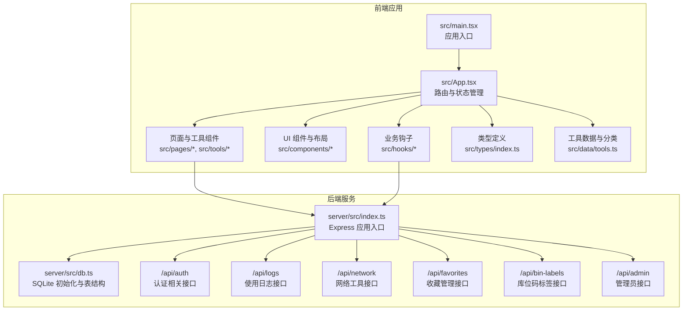

**图表来源**
- [src/main.tsx:1-14](file://src/main.tsx#L1-L14)
- [src/App.tsx:1-63](file://src/App.tsx#L1-L63)
- [server/src/index.ts:1-31](file://server/src/index.ts#L1-L31)
- [server/src/db.ts:1-126](file://server/src/db.ts#L1-L126)

**章节来源**
- [package.json:1-34](file://package.json#L1-L34)
- [server/package.json:1-23](file://server/package.json#L1-L23)
- [src/main.tsx:1-14](file://src/main.tsx#L1-L14)
- [server/src/index.ts:1-31](file://server/src/index.ts#L1-L31)

## 核心组件
- 应用入口与路由
  - 前端入口负责挂载 React 应用与路由配置，后端入口负责启动服务并注册各模块路由。
- 工具目录与分类
  - 提供工具清单与分类信息，支持按类别筛选与关键词搜索。
- 用户认证与偏好
  - 支持多种登录方式，提供用户信息缓存、收藏管理与最近使用记录。
- 数据持久化
  - 使用 better-sqlite3 连接本地 SQLite 数据库，初始化用户、日志、收藏、标签等表结构。

**章节来源**
- [src/App.tsx:1-63](file://src/App.tsx#L1-L63)
- [src/data/tools.ts:1-316](file://src/data/tools.ts#L1-L316)
- [src/hooks/useAuth.ts:1-89](file://src/hooks/useAuth.ts#L1-L89)
- [server/src/db.ts:1-126](file://server/src/db.ts#L1-L126)

## 架构总览
系统采用前后端分离设计，前端通过 fetch 与后端 API 交互，后端提供 RESTful 接口并维护本地数据库。整体流程如下：

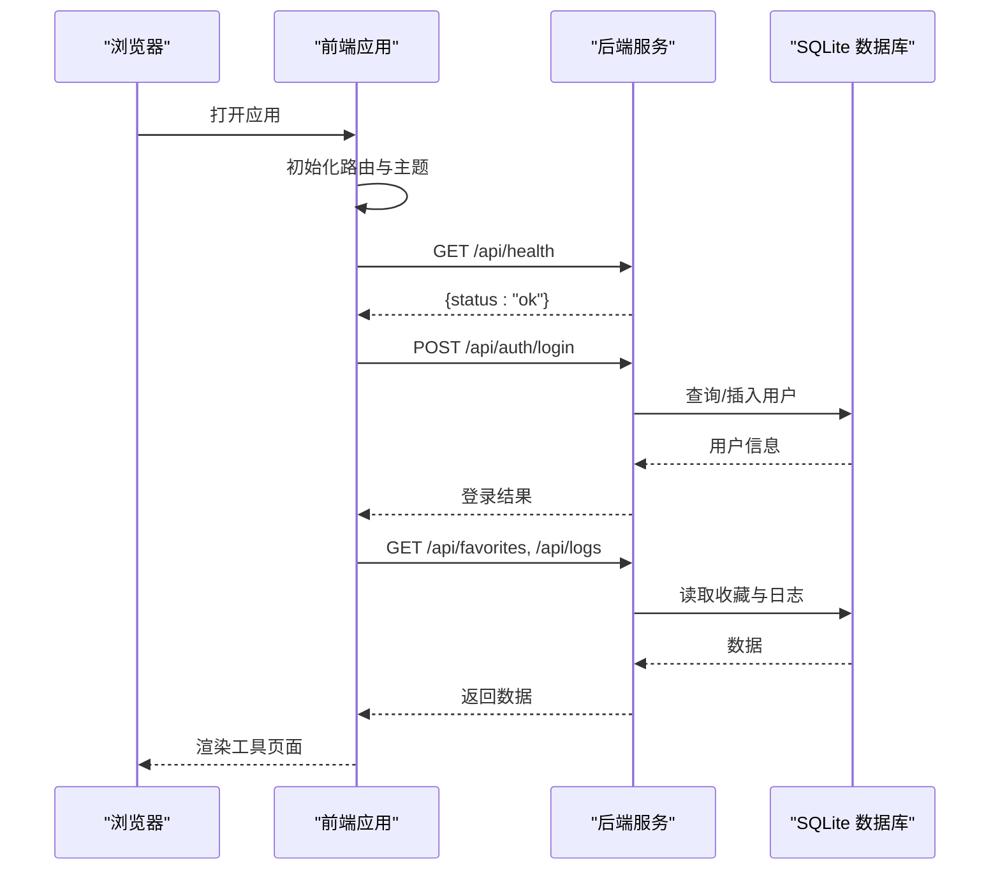

**图表来源**
- [server/src/index.ts:24-26](file://server/src/index.ts#L24-L26)
- [src/hooks/useAuth.ts:37-72](file://src/hooks/useAuth.ts#L37-L72)
- [server/src/db.ts:77-123](file://server/src/db.ts#L77-L123)

## 详细组件分析

### 前端应用与路由
- 路由控制
  - 主页、仪表盘、工具详情、版本日志、管理后台等页面通过 React Router 管理。
- 用户状态
  - 登录成功后缓存用户信息，支持登出与管理员入口。
- 主题与布局
  - 支持明暗主题切换，顶部导航包含搜索、版本日志、用户菜单等。

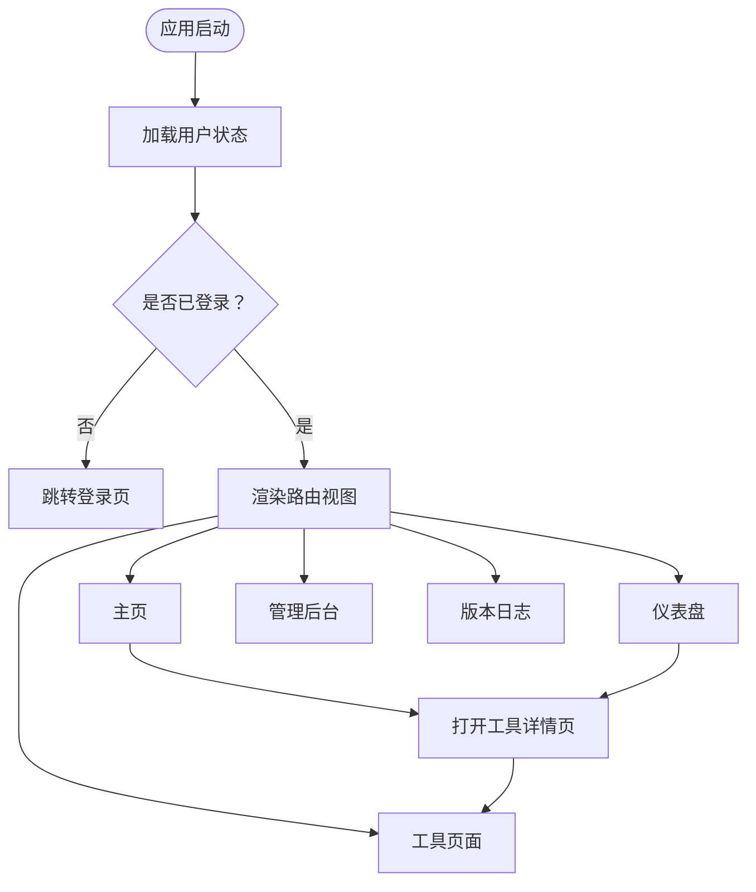

**图表来源**
- [src/App.tsx:12-60](file://src/App.tsx#L12-L60)
- [src/components/layout/Header.tsx:21-158](file://src/components/layout/Header.tsx#L21-L158)

**章节来源**
- [src/App.tsx:1-63](file://src/App.tsx#L1-L63)
- [src/components/layout/Header.tsx:1-159](file://src/components/layout/Header.tsx#L1-L159)

### 工具目录与分类
- 分类体系
  - 图像工具、开发工具、转换工具、文本工具、安全工具、网络工具六大类。
- 工具清单
  - 包含 JSON 格式化、Base64 编解码、正则测试、URL 编解码、时间戳转换、进制转换、颜色转换、单位转换、文本对比、Markdown 预览、文本加密、字数统计、库位码生成、条码/二维码生成、图片压缩、图片转 Base64、密码生成、Hash 计算、JWT 解析、证书查看、网速测试、IP 查询、HTTP 请求、DNS 查询、Ping 检测等。
- 搜索与筛选
  - 支持按名称、描述、标签进行模糊搜索。

```mermaid
classDiagram
class Tool {
+string id
+string name
+string description
+string category
+string[] tags
+string path
+boolean isNew
+boolean isHot
}
class CategoryInfo {
+string id
+string name
+LucideIcon icon
}
class ToolCategory {
<<enumeration>>
"development"
"conversion"
"text"
"image"
"security"
"network"
}
Tool --> CategoryInfo : "属于分类"
Tool --> ToolCategory : "分类枚举"
```

**图表来源**
- [src/types/index.ts:3-27](file://src/types/index.ts#L3-L27)
- [src/data/tools.ts:34-316](file://src/data/tools.ts#L34-L316)

**章节来源**
- [src/data/tools.ts:1-316](file://src/data/tools.ts#L1-L316)
- [src/types/index.ts:1-37](file://src/types/index.ts#L1-L37)

### 认证与用户偏好
- 登录流程
  - 支持微信、密码、访客三种登录方式，登录成功后写入本地存储。
- 用户信息
  - 缓存用户基本信息，提供管理员权限判断与新账户提示。
- 收藏与最近使用
  - 通过 API 获取收藏列表与最近访问记录，支持切换收藏状态。

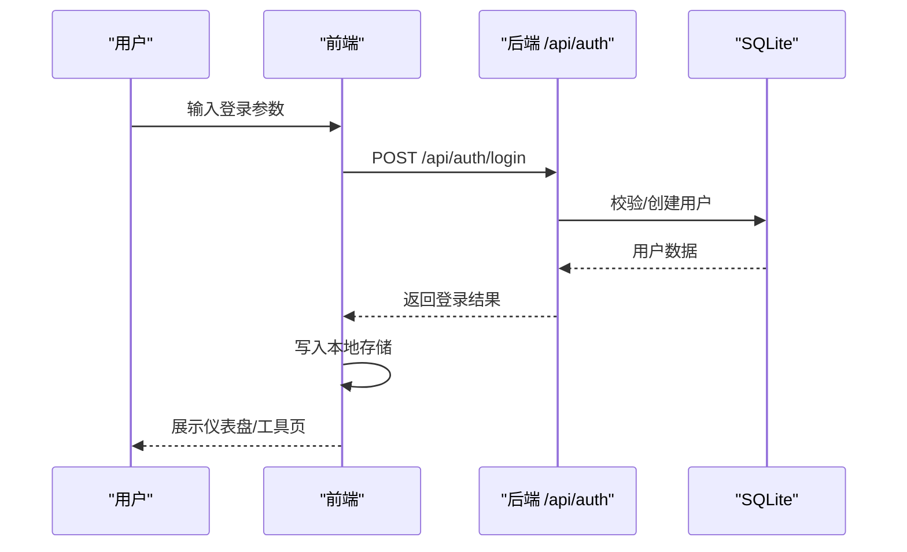

**图表来源**
- [src/hooks/useAuth.ts:37-72](file://src/hooks/useAuth.ts#L37-L72)
- [server/src/db.ts:77-123](file://server/src/db.ts#L77-L123)

**章节来源**
- [src/hooks/useAuth.ts:1-89](file://src/hooks/useAuth.ts#L1-L89)
- [server/src/db.ts:1-126](file://server/src/db.ts#L1-L126)

### 数据库设计与初始化
- 表结构
  - users：用户信息与角色
  - usage_logs：使用日志（用户、工具、动作、时间）
  - favorites：用户收藏（联合主键 user_id + tool_id）
  - bin_labels：库位码标签（用户、名称、数据、数量、时间）
  - login_sessions：登录会话（IP、UA、浏览器、操作系统等）
- 索引与约束
  - 为常用查询字段建立索引，启用外键约束保证数据一致性。
- 种子数据
  - 首次运行时自动插入示例用户与使用日志，便于演示。

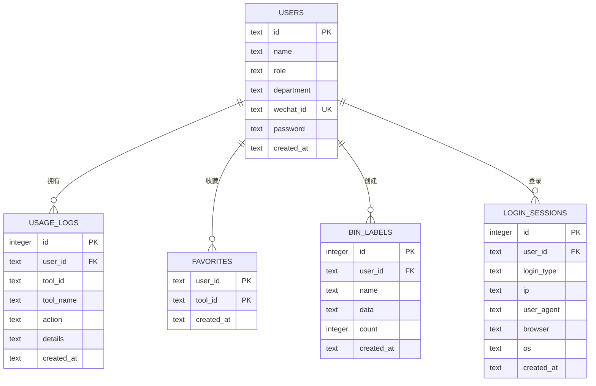

**图表来源**
- [server/src/db.ts:12-75](file://server/src/db.ts#L12-L75)

**章节来源**
- [server/src/db.ts:1-126](file://server/src/db.ts#L1-L126)

### 典型工具实现示例

#### Base64 工具
- 功能要点
  - 支持文本与 Base64 互转，提供复制输出结果能力。
  - 调用日志接口记录用户操作。
- 技术特点
  - 使用原生 atob/ btoa 进行编解码，异常时返回错误提示。

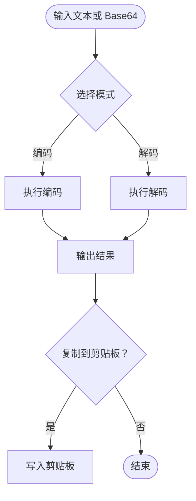

**图表来源**
- [src/tools/Base64Tool.tsx:8-63](file://src/tools/Base64Tool.tsx#L8-L63)

**章节来源**
- [src/tools/Base64Tool.tsx:1-64](file://src/tools/Base64Tool.tsx#L1-L64)

#### 图片压缩工具
- 功能要点
  - 支持选择图片、调节压缩质量、预览压缩前后效果并下载。
- 技术特点
  - 使用 Canvas 将图片绘制到画布并导出 Blob，计算压缩前后大小。

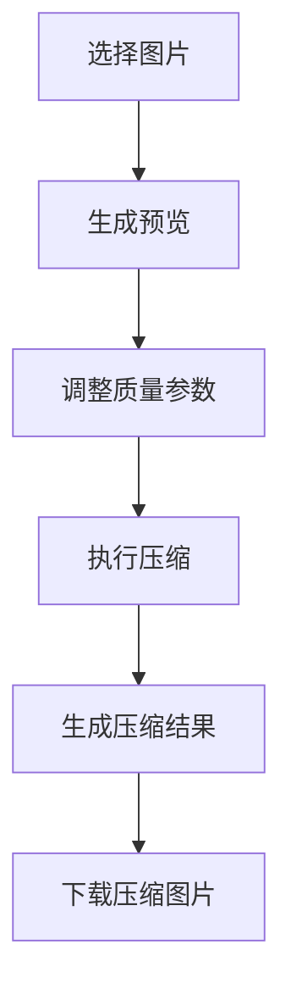

**图表来源**
- [src/tools/ImageCompress.tsx:7-100](file://src/tools/ImageCompress.tsx#L7-L100)

**章节来源**
- [src/tools/ImageCompress.tsx:1-101](file://src/tools/ImageCompress.tsx#L1-L101)

#### 密码生成工具
- 功能要点
  - 支持自定义长度与字符集（大小写字母、数字、特殊符号）。
- 技术特点
  - 基于随机池构建密码，支持一键复制。

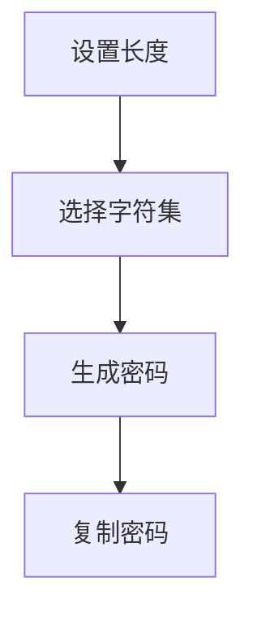

**图表来源**
- [src/tools/PasswordGenerator.tsx:28-83](file://src/tools/PasswordGenerator.tsx#L28-L83)

**章节来源**
- [src/tools/PasswordGenerator.tsx:1-84](file://src/tools/PasswordGenerator.tsx#L1-L84)

#### 网速测试工具
- 功能要点
  - 自动定位用户所在区域并探测最优测速节点，分别测量延迟、抖动、下载与上传速度。
- 技术特点
  - 使用 XMLHttpRequest 测速，支持进度展示与实时速度反馈，提供速度等级可视化。

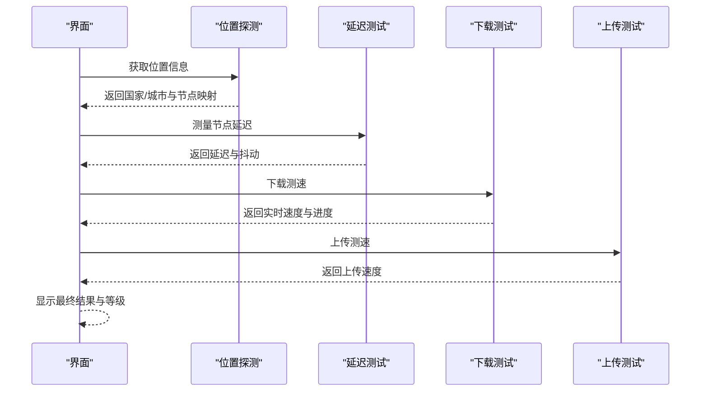

**图表来源**
- [src/tools/SpeedTest.tsx:185-466](file://src/tools/SpeedTest.tsx#L185-L466)

**章节来源**
- [src/tools/SpeedTest.tsx:1-523](file://src/tools/SpeedTest.tsx#L1-L523)

### 概念性概览
以下为概念性工作流图，展示用户从登录到使用工具的整体体验。

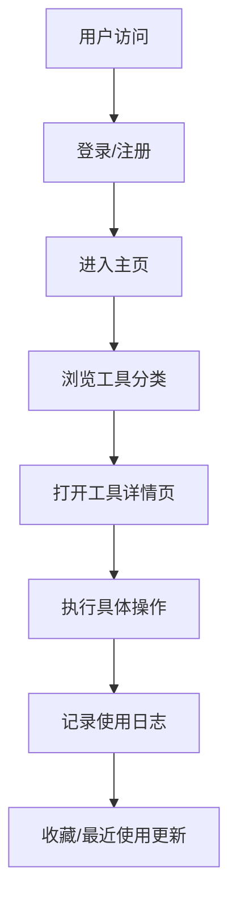

[此图为概念性流程，不直接对应具体源文件，故无图表来源]

## 依赖关系分析
- 前端依赖
  - React 生态（react、react-router-dom）、UI 组件库（lucide-react、tailwind 系列）、工具库（xlsx、jspdf）。
- 后端依赖
  - Express 框架、CORS 支持、better-sqlite3 数据库驱动。
- 开发工具
  - Vite、TypeScript、TailwindCSS、PostCSS。

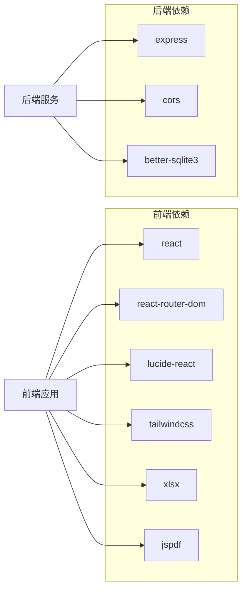

**图表来源**
- [package.json:11-31](file://package.json#L11-L31)
- [server/package.json:10-21](file://server/package.json#L10-L21)

**章节来源**
- [package.json:1-34](file://package.json#L1-L34)
- [server/package.json:1-23](file://server/package.json#L1-L23)

## 性能考虑
- 前端性能
  - 使用 React.lazy 与 Suspense（如需）拆分路由组件，减少首屏加载体积。
  - TailwindCSS 提供原子化样式，避免重复样式导致的包体膨胀。
- 后端性能
  - better-sqlite3 为本地嵌入式数据库，适合中小规模数据与演示场景；生产环境建议迁移到远程数据库并启用连接池。
  - 对高频查询字段建立索引，避免全表扫描。
- 工具性能
  - 图片压缩与测速等计算密集型任务应限制并发与超时，避免阻塞主线程。
  - 使用 AbortController 控制长耗时请求，及时取消无效任务。

[本节为通用性能建议，不直接分析具体文件，故无章节来源]

## 故障排除指南
- 登录失败
  - 检查后端 /api/auth/login 是否返回错误信息，确认网络请求与跨域配置。
- 数据库初始化问题
  - 确认 data.db 文件存在且可写，检查表结构初始化逻辑。
- 工具页面空白
  - 检查路由配置与工具组件路径，确保工具 ID 与路由参数一致。
- 测速异常
  - 确认网络可达性与 CORS 设置，必要时切换测速节点或禁用代理。

**章节来源**
- [src/hooks/useAuth.ts:37-72](file://src/hooks/useAuth.ts#L37-L72)
- [server/src/db.ts:77-123](file://server/src/db.ts#L77-L123)
- [src/tools/SpeedTest.tsx:277-308](file://src/tools/SpeedTest.tsx#L277-L308)

## 结论
AnyTools 通过清晰的前后端分离架构、完善的工具分类与丰富的功能实现，为开发者提供了一个高效、易用的一站式工具门户。其基于 React + TypeScript 的前端与 Express + SQLite 的后端组合，既保证了开发效率，又具备良好的可扩展性。未来可在用户认证完善、数据库迁移、工具扩展与性能优化等方面持续演进。

## 附录

### 快速开始指南
- 安装依赖
  - 前端：npm install
  - 后端：cd server && npm install
- 启动后端
  - cd server && npm run dev
- 启动前端
  - 在项目根目录执行 npm run dev
- 访问应用
  - 默认访问 http://localhost:5173

[本节为操作指引，不直接分析具体文件，故无章节来源]

### 基本使用示例
- 登录
  - 通过登录页选择登录方式，首次登录可能返回新用户提示。
- 使用工具
  - 在主页点击任意工具卡片，在新窗口中打开工具详情页并执行相应操作。
- 收藏与最近使用
  - 在仪表盘查看收藏与最近使用记录，支持切换收藏状态。

**章节来源**
- [src/pages/HomePage.tsx:18-139](file://src/pages/HomePage.tsx#L18-L139)
- [src/App.tsx:46-51](file://src/App.tsx#L46-L51)